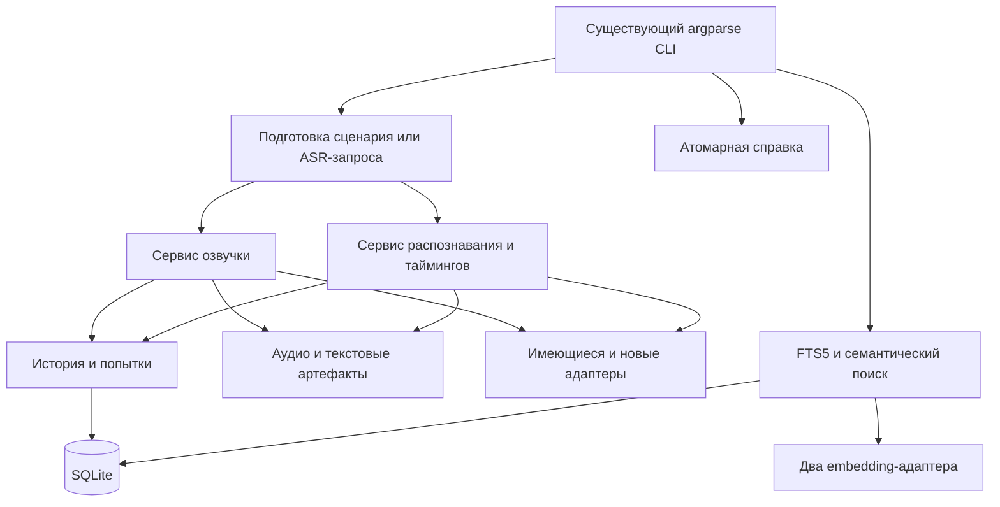
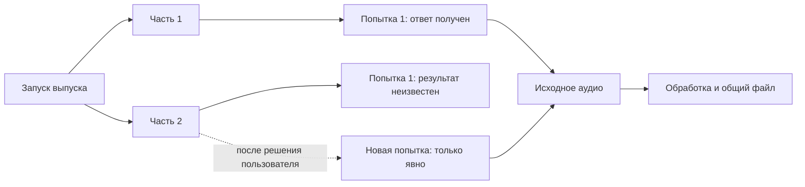
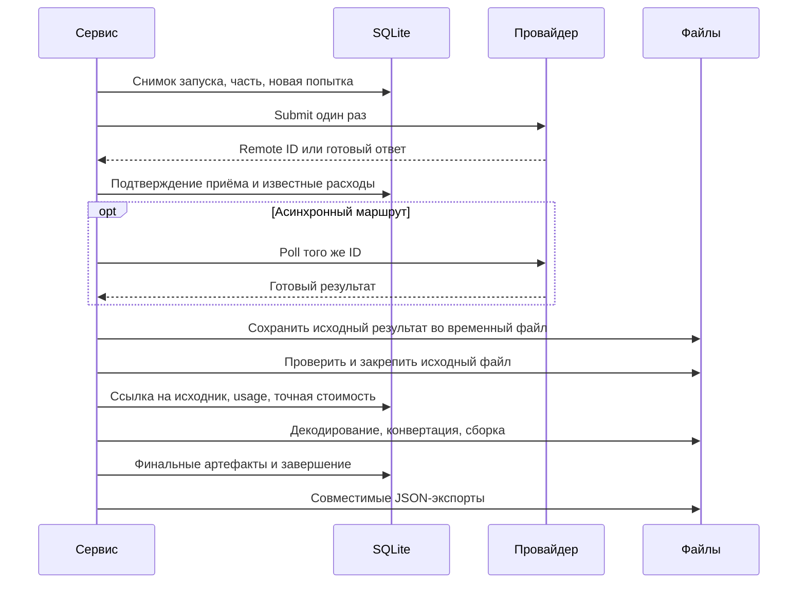
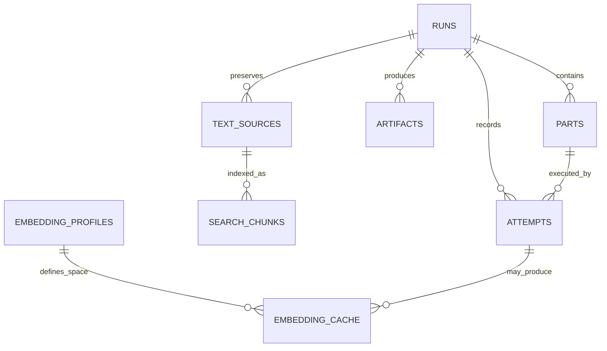
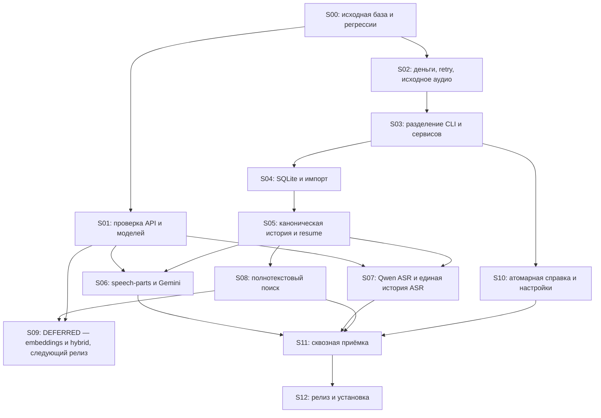

## VoiceOver Pipeline — план последовательной доработки речевой CLI 🎙️

> [!abstract] Цель
> Довести существующий `voiceover-pipeline` до инструмента, в котором можно **заказать озвучку, распознать аудио, сохранить полную историю и расходы, а затем найти результат по словам или по смыслу**. Развитие выполняется поверх имеющегося кода: без переписывания приложения, без переноса речи в image-утилиту и без универсального конструктора провайдеров.

| Поле | Значение |
|---|---|
| Репозиторий | `VladimirMonin/voiceover-pipeline` |
| Проверенный исходный коммит | `c64fd14dec1ce7cd4c6ed4ee174815787c172acb` |
| Дата подготовки | 29 сентября 2026 года |
| Основание | Чтение исходников репозитория, согласованные требования и проверка указанных в конце официальных источников |
| Характер документа | План реализации и приёмки, а не отчёт о завершённой разработке |
| Реализация по этому плану | `NOT_STARTED` |
| Тесты приложения в рамках подготовки | `NOT_RUN` |
| Платные запросы, загрузка весов, прослушивание | `NOT_RUN` |
| Целевой релиз | Рабочее обозначение `v0.7.0`; окончательная версия определяется перед релизом. Семантический/гибридный поиск (S09) в `v0.7.0` не входит и вынесен в отдельный [план следующего релиза](2026-10-01-semantic-search-next-release-plan.md) |
| Статус неизвестных API-возможностей | Отдельные интеграционные проверки, не подразумеваемая поддержка |

Исходный коммит зафиксирован по GitHub. В нём версия пакета в `pyproject.toml` — `0.6.1`, Python — `>=3.11`, обе команды `voiceover` и `voiceover-pipeline` направлены в существующий `cli:main`. Перед началом исполнения плана разработчик повторно проверяет HEAD и локальные изменения; отличия от этой базы требуют короткого повторного обзора, а не механического применения правок. [R01] [R02]

> [!important] Граница между планом и доказательствами
> Имена новых модулей, команд и тестов ниже являются **целевыми контрактами**. Они не объявляются уже существующими. Чтение теста доказывает наличие проверки в исходниках, но не её успешный запуск. HTTP 200 доказывает получение ответа, но не применение голоса или интонации. Для каждого этапа предусмотрен отдельный протокол фактически выполненных проверок.

### Навигация 🧭

| Раздел | Содержание |
|---|---|
| [1. Границы результата](#scope) | Что входит в доработку и что сознательно исключено |
| [2. Отправная точка](#baseline) | Что сохраняется и какие дефекты исправляются прежде всего |
| [3. Устройство после рефакторинга](#architecture) | Небольшие модули вместо логики внутри CLI |
| [4. Команды и сценарии](#cli) | Совместимость, простая озвучка и явные части |
| [5. Выполнение и расходы](#execution) | Попытки, безопасное восстановление, точный учёт |
| [6. SQLite и файлы](#storage) | Схема, миграция старых каталогов, один источник состояния |
| [7. ASR и модели](#asr) | Qwen, существующие провайдеры, тайминги и происхождение результатов |
| [8. Поиск](#search) | FTS5 в `v0.7.0`; локальные/облачные embeddings и гибрид — отложенный S09 следующего релиза |
| [9. Документация и настройки](#docs) | Атомарный help, `.env`, установка необязательных компонентов |
| [10. Логирование](#logging) | События, корреляция, защита данных |
| [11. Этапы и коммиты](#stages) | Последовательность, параллельные ветки и критерии закрытия |
| [12. Матрица проверок](#tests) | Что именно должны доказывать автоматические и живые тесты |
| [13. Релиз и установка](#release) | Приёмка, тег, `uv tool`, резервирование и откат |
| [14. Источники](#sources) | Постоянные ссылки на код и первичную документацию |

<a id="scope"></a>
## 1. Границы результата: один продукт для речи 🎯

Распределение ответственности фиксируется явно: image-утилита занимается изображениями, VoiceOver Pipeline — речью, распознаванием, таймингами и соответствующей историей. Общая стилистика команд, JSON и справки полезна, но общий Python-фреймворк, общая БД двух продуктов или вызов одной утилиты из другой не требуются.

Предыдущий `10-speech-generation-plan.md` используется как источник **функциональных требований** к новой озвучке: готовые части от автора, один голос на часть, общая и частная подача, проверка длины, сохранение расходов и сборка аудио. Его предположения о классах aimedia, её миграциях и именах команд **не переносятся буквально** в существующий VoiceOver Pipeline. Исходный speech-план отдельно фиксирует один голос на часть, заранее заданные границы и отсутствие автоматической нарезки. fileciteturn16file0L127-L150 Документы `01`–`09` image-проекта остаются архитектурным ориентиром, а не инструкцией заменить уже работающие речевые компоненты.

### Что должно получиться ✅

| Область | Обязательный результат этого цикла |
|---|---|
| Существующая озвучка | Сохранены старые команды, сценарии, локальные движки и совместимые манифесты |
| Новая озвучка | Простая фраза из CLI; YAML с явно подготовленными частями; голос и vibe для каждой части |
| Gemini | Интеграция двух согласованных TTS-моделей через подтверждённый маршрут Polza |
| Qwen ASR | Приведение существующего локального адаптера к настраиваемым путям; поддержка выбранных 0.6B/1.7B; ограниченная интеграция Qwen ASR через Polza |
| История | TTS, ASR, timings и проверки результата записываются в SQLite, включая исходные тексты, параметры, попытки и пути |
| Деньги | Стоимость конкретных запросов, точные десятичные значения, RUB/USD отдельно, неизвестные суммы явно отмечены |
| Полнотекстовый поиск | Работает сразу после сохранения текста, без модели и без сети |
| Семантический поиск | Два конкретных режима: локальный Qwen3-Embedding-0.6B и облачный Qwen3-Embedding-8B через Polza. **Вне scope `v0.7.0`** (S09 `DEFERRED`) — вынесено в [план следующего релиза](2026-10-01-semantic-search-next-release-plan.md) |
| Справка | Одни атомарные Markdown-файлы доступны в репозитории и установленной CLI |
| Надёжность | Повтор скачивания или конвертации не создаёт повторную платную генерацию |
| Приёмка | Есть воспроизводимые тесты, отчёты, ограничения поддержки и релизный артефакт |

Функции семантического поиска спроектированы как реальная реализация, а не пустая заготовка, но **не входят в `v0.7.0`**: S09 вынесен в [план следующего релиза](2026-10-01-semantic-search-next-release-plan.md). Их **использование и тяжёлые зависимости остаются необязательными**: базовая CLI генерирует, транскрибирует и ищет по словам без embeddings.

### Что не строится 🚫

Не добавляются GUI, сервер, Celery/Redis, распределённые очереди, универсальный plugin marketplace, каскад YAML-наследования, RAG-чат, reranker, автоматический выбор «лучшего» провайдера и автоматическая валютная конвертация. Не переписываются локальные GPU-движки и не меняется весь стек HTTP/CLI ради единообразия.

Для нового TTS-формата отсутствуют автоматическая нарезка, подбор эмоций, переписывание текста и незаметный переход к нативному multi-speaker. Два голоса в итоговой записи означают последовательность одно-голосных частей. Нативный диалог в одном API-запросе не является условием завершения этого плана.

### Модели разных назначений не смешиваются 🧬

| Задача | Конкретный объект работы | Решение |
|---|---|---|
| Облачная озвучка | Gemini 3.8 Flash TTS и Flash-Lite TTS | Сохранить ранее согласованный объём, не подменять его Qwen |
| Локальная озвучка | Уже имеющиеся Qwen3-TTS и OmniVoice | Сохранить и провести через новые историю/части/учёт; не разрабатывать повторно |
| Локальное распознавание | `Qwen/Qwen3-ASR-0.6B`, `Qwen/Qwen3-ASR-1.7B` | Первая уже присутствует в адаптере; вторую подключать после проверки выбранного runtime |
| Облачное распознавание | `qwen/qwen3-asr-flash-2026-02-10` через Polza | Отдельный ASR-маршрут, без обещания недокументированных таймкодов |
| Локальные embeddings | `Qwen/Qwen3-Embedding-0.6B` | Именно embedding-модель, не разговорная `Qwen3-0.6B` |
| Облачные embeddings | `qwen/qwen3-embedding-8b` через Polza | Один конкретный embedding-adapter |

Локальная ASR 0.6B, Qwen TTS и отдельный forced aligner уже видны в коде. Карточка Qwen подтверждает существование ASR 1.7B; карточки embedding-семейства подтверждают отдельные embedding-модели. Это разные семейства с разными зависимостями, а не один переключатель «Qwen». [R05] [R06] [W01] [W02]

<a id="baseline"></a>
## 2. Отправная точка и приоритет исправлений 🔍

### Что сохраняется 🧱

Существующие `ScriptChunk`, результаты синтеза и ASR, `run_state.json`, `manifest.json`, каталог `chunks/`, FFmpeg-операции, resume, timing-адаптеры и generic ASR образуют полезную основу. Уже есть небольшой Python-реестр ASR-провайдеров: его подход подходит для ограниченного TTS-реестра, без нового конфигурационного языка. [R04] [R05] [R07]

Сохраняются `argparse`, минимальная версия Python, обе console-команды и имена действующих параметров. `--format` уже выбирает **формат сценария**, а `--resume` является boolean-флагом. Эти значения нельзя молча заменить соответственно на аудиокодек и идентификатор задания. [R02] [R03]

### Находки, превращаемые в конкретные задачи 🛠️

| Приоритет | Место в текущем коде | Наблюдение и риск | Исправление и проверяемый результат |
|---|---|---|---|
| P0 | `pricing.py`, `cli.py::attach_costs` | История Polza выбирается по периоду/модели, затем связывается с частями по позиции | Стоимость привязывается по подтверждённому remote ID; две параллельные сессии не обмениваются расходами |
| P0 | `cost_from_generation`, извлечение usage | Используются `or` для цен и `float` | Ноль сохраняется; Decimal проходит полный путь без промежуточного float |
| P0 | `PolzaTTSProvider._synthesize_media`, `retry.py` | Submit, polling и скачивание объединены; внешний retry может повторить POST | Persist remote ID до ожидания; повтор GET/скачивания не создаёт новую генерацию |
| P0 | Цикл генерации и `run_state.py` | Полная запись части формируется после обработки аудио | Сначала сохраняются факт ответа, расходы и исходное аудио; локальный сбой не требует нового TTS |
| P0 | Resume обычной озвучки | Полная идентичность синтеза применена не одинаково во всех режимах | Общая проверка текста, модели, голоса, vibe и влияющих на синтез параметров |
| P1 | `polza_tts.py` | Всё аудио, не обозначенное MPEG, маркируется `pcm16` | WAV/MP3/FLAC/OGG и raw PCM различаются; контейнер не декодируется как сырые семплы |
| P1 | `openrouter_tts.py`, `voiceover_script.py`, Polza speech | Стиль либо не передаётся, либо отключён | Новая поддержка vibe внедряется только по рабочему контракту конкретной пары модель/провайдер |
| P1 | `cli.py` | Файл совмещает parser, исполнение, деньги, resume, обработку и представление | Логика выносится небольшими изменениями; исходные команды проходят контрактные регрессии |
| P1 | `voiceover_script.py` | `max_chunk_chars` из frontmatter не участвует в показанном разрешении лимита | Один фактический предел; dry-run и реальная отправка используют одинаковый расчёт |
| P1 | `config.py`, Qwen ASR adapter | Пути зависят от CWD при импорте либо зафиксированы под конкретный Linux-каталог | Пути разрешаются при запуске; есть настройки модели/кеша и проверка соответствия model ID файлам |
| P1 | `GenerationLogger` | Поля записываются без централизованной очистки; исключения могут содержать raw body/URL | Секреты, содержимое запросов и подписанные URL не просачиваются в диагностику |
| P1 | Сборка и документация | Наличие `/docs` в sdist не обеспечивает runtime-доступ из wheel | Справка включена в wheel и проверена вне checkout |

Эти наблюдения основаны на чтении конкретных функций, а не на воспроизведении всех ошибок. Первые коммиты должны превратить риски в падающие регрессионные тесты, а затем исправить их. Нельзя писать «история расходов уже была неверной», пока конкретная старая запись не проверена. [R03] [R06] [R07] [R08] [R09] [R10] [R11] [R12]

Версии `pyproject.toml`, `__version__`, манифеста и skill также сверяются в S00. Единый источник версии — отдельная маленькая правка, не повод менять packaging-систему.

<a id="architecture"></a>
## 3. Целевая конструкция без переписывания 🏗️



### Границы модулей 📦

Предлагается сохранить `cli.py` как совместимый входной модуль и постепенно вынести реализации. Существующие import-пути, используемые тестами или внешним кодом, временно поддерживаются тонкими wrappers. Перенос кода не смешивается в одном коммите с изменением поведения.

```text
src/voiceover_pipeline/
├── cli.py                         # совместимый main/build_parser
├── commands/                      # обработчики, вывод, маршрутизация
├── services/
│   ├── prepare.py                 # PreparedRun / PreparedPart
│   ├── synthesis.py               # TTS, сохранение, сборка
│   ├── transcription.py           # обёртка существующих ASR/timing путей
│   └── recovery.py                # возобновление без повторного submit
├── history/
│   ├── database.py
│   ├── repository.py
│   ├── migrations/
│   └── legacy_import.py
├── search/
│   ├── lexical.py
│   ├── indexing.py
│   ├── vector.py
│   └── embeddings.py              # два конкретных адаптера
├── help_system.py
├── resources/help/                # канонические Markdown-файлы
├── providers/                     # текущие адаптеры сохраняются
├── config.py
├── pricing.py                     # может стать фасадом денежного слоя
└── остальные существующие модули
```

Это ориентир ответственности, а не требование создать все файлы заранее. Если две короткие функции читаются лучше в одном модуле, отдельный класс для каждой не создаётся.

### Стек и зависимости 🧰

| Задача | Решение |
|---|---|
| CLI | Сохранить `argparse` |
| Внутренние данные | Сохранить dataclasses; добавить только необходимые типы |
| HTTP | Сохранить текущие `requests`/OpenAI SDK; исправить жизненный цикл и retry, не мигрировать всё на async |
| SQLite | Стандартный `sqlite3`, параметризованные SQL-запросы, небольшой migration runner |
| Новый YAML сценария | Safe YAML loader; существующий ограниченный Markdown-frontmatter не переписывается на ходу |
| Постоянные настройки | TOML через `tomllib`, доступный в выбранной базовой линии Python |
| Аудио | Существующий FFmpeg/ffprobe-путь с проверяемым контрактом форматов |
| FTS | SQLite FTS5, без внешнего поискового сервиса |
| Векторы | Необязательный `sqlite-vec` |
| Локальные embeddings | Необязательный `sentence-transformers` для одной Qwen embedding-модели |
| Облачные embeddings | Небольшой клиент существующего Polza `/embeddings` |
| Тесты | Существующие pytest/Ruff/mypy; `pytest-cov` только как инструмент измерения, не доказательство корректности |

Выбор `sqlite3` вместо нового ORM — решение этого плана для **данного репозитория**, где ORM пока не требуется существующим стеком. Сходство с image-утилитой достигается одинаковыми понятиями истории и расходов, а не обязательной одинаковостью библиотек. Смена этого решения допустима отдельным обоснованным изменением до S04, но не параллельной реализацией двух хранилищ.

### Минимальный контракт подготовленного запуска 🧩

`PreparedRun` содержит operation, выбранные provider/model, снимок входа, список `PreparedPart`, выходные настройки и fingerprint. `PreparedPart` содержит стабильный ID, позицию, исходный текст, один голос и итоговый vibe. Это данные, а не новый универсальный DSL.

TTS-адаптер получает подготовленную часть. Голос не передаётся специальной веткой `isinstance(OpenRouterTTSProvider)`, а является частью общего вызова. Для старых адаптеров допустим совместимый wrapper над `synthesize_chunk`. Generic ASR остаётся отдельным интерфейсом: embedding-запрос не превращается в TTS-часть. [R04]

Новая абстракция вводится только там, где она устраняет действующее дублирование или обеспечивает сохранение оплаченного результата. Пустые базовые классы для будущих облаков не создаются.

<a id="cli"></a>
## 4. CLI и подготовка речевого сценария ⌨️

### Совместимость как первый контракт 🔒

Сохраняются `generate`, `split`, `validate`, `doctor`, `status`, `concat`, `timings`, `transcribe`, `verify-tts`, `list`, существующие JSON-оболочки и значения exit codes. Не импортируются новые коды `2–9` из image-проекта: у VoiceOver уже есть коды `0`, `2`, `10`, `11`, `20`, `30`, `40`, `50`, `60`. Для новых исторических/поисковых ошибок добавляется стабильный строковый `error_code`; отдельный числовой код вводится только после фиксации общего контракта. [R03]

Изменение небезопасного автоматического повтора оплачиваемого POST — намеренная корректировка поведения. Оно документируется в changelog: параметр `--retries` больше не даёт разрешение повторять неопределённый платный submit.

### Новые команды и опции, подлежащие реализации 🧭

| Интерфейс | Назначение |
|---|---|
| `generate --text ... --voice ... --vibe ...` | Одна простая реплика |
| `generate --script ... --format speech-parts` | Явные части нового YAML |
| `generate --audio-format wav` | Выходной аудиоформат, без изменения смысла `--format` |
| `history list`, `history show ID` | Глобальная история независимо от CWD |
| `history import DIR --dry-run`, `history import DIR` | Безопасный импорт старых каталогов |
| `history resume ID` | Возобновление из сохранённого снимка, а не изменённого исходного файла |
| `history sync ID` | Только получить состояние/результат уже известной операции, без нового submit |
| `history costs` | Итоги по валютам, операциям и полноте данных |
| `search QUERY --mode lexical` | Поиск сохранённых текстов и связанных аудиофайлов; `semantic\|hybrid` — честный отказ до S09 следующего релиза |
| `index build`, `index status`, `index rebuild` | Явное построение и обслуживание поисковых индексов |
| `help TOPIC --raw\|--json` | Документация из установленных ресурсов |
| `config path`, `config show` | Пути и эффективные несекретные настройки |

Точная расстановка общих флагов фиксируется одним parser-тестом. Для совместимости примеры используют `--json` в конце конкретной команды. Не создаётся новый глобальный JSON-формат вместо действующего `status: success/error`.

### Короткая реплика 💬

Следующая команда — пример **будущего** интерфейса после подтверждения Polza-маршрута:

```bash
voiceover generate --provider polza-tts --model google/gemini-3.8-flash-tts --text "Добрый вечер. Начинаем выпуск." --voice Kore --vibe "Спокойный ведущий образовательного подкаста." --audio-format wav --run-id intro --json
```

`--text` и явно переданный `--script` взаимоисключающие. Текущее автоматическое значение default script не должно случайно делать `--text` несовместимым: parser обязан различать явный аргумент и default. Вызов без нового `--text` сохраняет старое поведение выбора сценария.

В простом режиме формируется одна часть. `--vibe` — свободная строка, не enum эмоций. Если выбранный маршрут не может передать инструкцию без зачитывания, команда возвращает понятную ошибку до платного запроса; инструкция не выбрасывается молча.

### Составная запись: один понятный YAML 📄

```yaml
version: 1
format: speech-parts
vibe: >-
  Образовательный подкаст о программировании.
  Естественная разговорная речь без рекламного пафоса.
parts:
  - voice: Kore
    vibe: С любопытством, как вопрос собеседнику.
    text: |-
      Что изменится, если сохранить историю всех запусков?
  - voice: Puck
    vibe: Спокойно и уверенно, с поясняющей интонацией.
    text: |-
      Тогда результат можно будет найти не только по имени файла,
      но и по содержанию разговора.
  - voice: Kore
    vibe: С лёгким воодушевлением.
    text: |-
      Значит, старые записи перестанут теряться среди папок.
```

```bash
voiceover validate --script ./podcast.yaml --format speech-parts --provider polza-tts --model google/gemini-3.8-flash-tts --json
```

```bash
voiceover generate --script ./podcast.yaml --format speech-parts --provider polza-tts --model google/gemini-3.8-flash-tts --audio-format wav --run-id podcast-01 --json
```

В новом формате provider/model задаются аргументами или постоянными defaults приложения, не дублируются внутри сценария. Голоса и обе разновидности vibe находятся в YAML; CLI `--voice`/`--vibe` для такого сценария отклоняются, чтобы не создавать скрытые overrides. Старые frontmatter provider/model продолжают работать в **старых** форматах.

В каждой части ровно одна строка `voice`. Нет отдельного реестра персонажей, вложенных конфигураций и автоматического объединения частей. Фактическая последовательность совпадает с `parts`.

### Текст и инструкции разделены 🎭

Итоговая инструкция части — общий vibe, затем два перевода строки, затем vibe части; отсутствующие значения пропускаются. В поле произносимого текста остаётся только `text`. При противоречии настроений приложение не пытается интеллектуально разрешить конфликт: автор видит сформированную инструкцию в dry-run и истории.

Исходный vibe и сформированный `effective_vibe` сохраняются отдельно. Преобразование этой инструкции в поле внешнего API выполняет адаптер, и конкретный mapping покрывается тестом. Объявление поддержки в локальном реестре невозможно без подтверждения реального маршрута.

### Проверка длины без чанкера 📏

До первого внешнего вызова проверяются **все части**. Счётчик работает по строкам после чтения UTF-8/BOM и разбора YAML, учитывая пробелы, переводы строк и теги. Текст не обрезается и не «улучшается» через `strip()`; `strip()` разрешён только для проверки пустоты.

Начальный консервативный бюджет нового Polza-режима:

```text
request_chars = len(text) + len(effective_vibe) + len(required_text_wrapper)
request_chars <= 5000
```

5000 — исходная политика совместимости приложения на основании опубликованного предела `input` Polza, **не доказанный предел Gemini**. Документация Polza отдельно ограничивает инструкции и описывает их для другого семейства, поэтому соответствие счётчика реальному запросу проверяется в S01. Токены не переводятся в символы приблизительным коэффициентом. [W04]

Если подтверждённый маршрут имеет отдельные ограничения полей, они учитываются небольшими техническими проверками адаптера. Пользователь не получает второй язык конфигурации. Любой добавленный служебный текст учитывается до отправки; молчаливого превышения после dry-run нет.

Предел проверяется как `L-1`, `L`, `L+1`, включая общий vibe. Unicode code points, UTF-8-байты и UTF-16 code units не смешиваются; реальная пограничная проверка emoji фиксируется отдельно. Более короткий текст не гарантирует соблюдение любого токенного ограничения API.

### Что считается минимальной проверкой 🧪

Файл читается безопасным loader, версия известна, `parts` непустой, текст и голос — непустые строки, vibe — строка, порядок известен, размер допустим, выходной путь доступен. Дубликаты ключей YAML не принимаются молча. Приложение не интерпретирует смысл интонации, не проверяет количество языков и не запрещает теги по самодельному словарю.

Существующие проверки legacy dialogue, локальных профилей и `verify-tts` сохраняются в своих режимах. Новый `speech-parts` не запускает скрытую облачную ASR-проверку после каждой реплики. Контроль произнесённого текста доступен явной командой, а на live-приёмке обязателен как проверка результата, не как валидатор входного настроения.

<a id="execution"></a>
## 5. Исполнение: сохранить оплаченное, затем обрабатывать 🔄

### Запуск, часть и попытка — разные единицы 🧩

**Запуск** — пользовательская работа, например озвучить выпуск или распознать лекцию. **Часть** — подготовленный фрагмент этой работы. **Попытка** — конкретное обращение к модели, которое могло стоить денег. Эти три понятия необходимы для восстановления и учёта, но не требуют очереди заданий или диспетчера worker-процессов.

Повторное скачивание результата относится к той же попытке. Повторный платный синтез создаёт новую попытку и не удаляет старую. Пересборка WAV/MP3 не создаёт TTS-попыток вообще. Полное повторение уже завершённой работы создаёт новый запуск со ссылкой на предыдущий.



### Порядок сохранения 🧾

Перед сетью фиксируются снимок подготовленного запуска, части, выходные пути и запись попытки. Затем выполняется submit. Как только получен remote ID, он записывается отдельно от будущего аудиорезультата. При получении ответа доступны два независимо важных результата: финансовые сведения и полезное содержимое. Их нужно сохранить до необязательной конвертации, обрезки или проверки качества.



Нельзя удерживать SQLite-транзакцию во время HTTP, ожидания GPU или FFmpeg. Операции БД короткие. Когда запись SQLite не удалась после получения аудио, исходник сохраняется в каталоге запуска вместе с небольшим обезличенным recovery receipt: UUID попытки, fingerprint, remote ID, хеш, формат и путь. Это аварийное подтверждение, **не второй независимый state engine**.

Если исходник тоже невозможно сохранить, ошибка честно указывает неопределённость дальнейшего восстановления. Программа не обещает exactly-once для внешнего API без серверной идемпотентности.

### Разделение состояния и стадии 🚦

Пользовательские статусы продолжают сериализоваться в прежнем формате. Для внутренней работы достаточно дополнительно записывать стадию попытки и причину остановки: `prepared`, `submitting`, `remote_accepted`, `response_recorded`, `raw_saved`, `finalized`, `failed`, `outcome_unknown`.

Не обязательно показывать все стадии в кратком stdout. Они нужны, чтобы после перезапуска отличить «можно продолжить скачивание» от «неизвестно, принял ли провайдер POST». Подробный `history show` показывает эти различия и доступное действие.

| Событие | Действие без нового платного запроса | Новая генерация |
|---|---|---|
| Ответ на POST потерян, ID неизвестен | Сохранить `outcome_unknown`; предложить сверку по проверяемому ID, если он найден | Только отдельное явное решение, не автоматический retry |
| ID известен, polling прерван | Продолжить polling того же ID | Не требуется |
| Исходное аудио уже сохранено | Повторить только конвертацию/проверку/склейку | Запрещено при обычном resume |
| Финальный файл готов, JSON-экспорт не записан | Повторить экспорт из БД | Запрещено |
| Провайдер явно отклонил генерацию | Сохранить ошибку и известный usage | Новая попытка только по явному запуску/resume с разрешением повторения |
| Часть ещё не отправлялась | При `resume` отправить её в штатном порядке | Это новая запланированная работа, а не восстановление старого POST |

`history sync` не выполняет новые генерации. `history resume` может продолжить **ещё не отправленные** части, поэтому является потенциально платной операцией. Неопределённая попытка блокирует автоматическое продолжение этой части; одного слова `resume` недостаточно, чтобы молча оплатить её ещё раз.

При `Ctrl+C` прекращается локальное ожидание и запуск новых частей. Уже известные remote IDs и сохранённые результаты остаются в истории; удалённая отмена не отправляется автоматически. При прерывании submit без подтверждённого ответа сохраняется неопределённый исход, а не ложный статус «ничего не запущено». Повторное исполнение не превращает interrupt в разрешение на ещё одно списание.

### Идентичность синтеза и защита частей 🔐

Fingerprint вычисляется по каноническому представлению того, что влияет на результат: provider/model, реальный model ID, последовательность частей, точный текст, voice, effective vibe, настройка влияющих на синтез режимов и версия преобразования запроса. Для локального голоса добавляются fingerprint профиля и реальная версия/путь runtime, если это уже предусмотрено существующими механизмами.

Параметры финальной упаковки файла, не меняющие синтез, учитываются отдельно. Например WAV → MP3 при готовых WAV-частях не должен требовать новую генерацию. Изменение текста, голоса или vibe — должно отклонять несовместимое продолжение до сети.

Существующий `generate --resume` остаётся совместимым и проверяет предоставленный сценарий. Новый `history resume UUID` использует сохранённый снимок и не зависит от того, был ли позже изменён `script.md`. Пропавший или изменённый голосовой reference input не считается прежним только потому, что путь совпадает.

### Аудиоформаты и склейка 🎧

В ответе отдельно определяются контейнер, кодек и, только для raw PCM, частота, число каналов, разрядность и порядок байтов. Неподдерживаемый MIME не превращается в PCM по умолчанию. Формат подтверждается декодированием и ffprobe, а не расширением URL.

Новые части приводятся к согласованному WAV/PCM-представлению перед склейкой. WAV-заголовки не конкатенируются как произвольные байты; MP3 не склеиваются наивным сложением файлов. Порядок определяется позицией частей, не порядком завершения запросов. Для нового формата не добавляются скрытая нормализация громкости, crossfade, обрезка пауз или автоматические вставки тишины. Старые режимы сохраняют документированную обработку.

Оплаченные исходники и части не считаются безусловно удаляемым кешем. Очистка таких файлов допускается только отдельной командой с предварительным списком и явным подтверждением. Ошибка финального FFmpeg не удаляет успешно полученные части.

### Расходы: точность важнее красивого итога 💰

Каноническое значение суммы хранится как десятичная строка в SQLite и обрабатывается `Decimal`. Извлечение чисел из JSON не должно сначала проводить их через binary float, если транспорт позволяет разобрать decimal напрямую. Совместимый старый numeric-показатель может оставаться в публичном JSON, но рядом предоставляются точная строка и признак источника.

Результат сопоставляется **по известному remote ID и области провайдера/аккаунта**, а не по позиции в выдаче истории. Идентификатор уже связанной генерации не перезаписывается во время «уточнения стоимости». Когда надёжного ID нет, стоимость остаётся неизвестной. [R09]

Область финансового идентификатора включает канонического поставщика, несекретный account alias, тип операции и remote ID. Адаптеры `polza-tts` и `polza-chat-audio` не должны случайно дважды учитывать одну и ту же подтверждённую операцию агрегатора. При неоднозначном совпадении данные не объединяются автоматически.

| Ситуация | Сохранение и отчёт |
|---|---|
| API сообщил `0` | Известная нулевая стоимость, не `NULL` |
| Цена отсутствует | `unknown`, не подстановка каталожного тарифа |
| Локальное исполнение | Нет внешнего API-списания; электричество и амортизация не оцениваются |
| Ответ получен, конвертация упала | Полученная цена остаётся в попытке |
| Повторная платная попытка | Отдельная строка; обе известные цены участвуют в расходах |
| Повторный запрос статуса вернул ту же цену | Обновление наблюдения, а не второе списание |
| Позднее подтверждённая цена изменилась | Сохранить историю наблюдений и актуальное подтверждённое значение; не суммировать все наблюдения |
| Embedding-batch содержал 16 текстов | Цена одного batch-request учитывается один раз, не по 16 одинаковых начислений |
| Вектор взят из кеша | Нового списания нет; исходная оплата остаётся у создавшей его попытки |

`history costs` группирует по валюте и типу операции. Вложенная ASR-проверка TTS и индексация могут быть связаны с исходным запуском, но глобальный итог складывается по уникальным финансовым попыткам, а не по суммам родителей и детей одновременно.

Пример целевого денежного блока нового отчёта; значения демонстрационные:

```json
{
  "totals": [
    {"currency": "RUB", "known_amount": "12.3400", "unknown_attempts": 2},
    {"currency": "USD", "known_amount": "0.0831", "unknown_attempts": 0}
  ],
  "completeness": "partial",
  "local_attempts_without_api_charge": 3
}
```

Лимит числа облачных запросов является жёстким локальным ограничителем. Денежный бюджет на основе последней известной цены — только оценка: при неизвестной цене нельзя гарантировать остановку ровно перед заданной суммой. Приложение явно различает эти гарантии.

<a id="storage"></a>
## 6. SQLite, файлы и перенос существующей истории 🗃️

### Одна локальная база и явные каталоги 📁

История не должна зависеть от текущей рабочей папки. Вводится `VOICEOVER_HOME` и системный data directory по умолчанию. БД, индексы и новые управляемые каталоги располагаются там. Установка через `uv tool` не является местом хранения пользовательских данных.

```text
<VOICEOVER_HOME>/
├── history.sqlite3
├── runs/
│   └── <run-uuid>/
│       ├── source/                 # снимок сценария или текстового входа
│       ├── raw/                    # оригинальные ответы/аудио без секретов
│       ├── chunks/                 # устойчивые части, пригодные для resume
│       ├── manifest.json
│       └── generation.log
├── backups/
└── logs/
```

Это новая управляемая область. Прежний `--output-dir` и привычное расположение старых запусков продолжают работать; принудительное перемещение старых `out/` не выполняется. БД хранит `run_root` и относительные пути артефактов внутри него. Произвольный внешний output хранится как явно внешний абсолютный путь и не удаляется автоматической очисткой.

Одинаковый пользовательский `--run-id prod` в двух разных каталогах не означает один запуск. Внутренний ключ — UUID; пользовательская метка и старый run-id остаются отдельными полями. Для старых команд область идентичности учитывает каталог; поиск по метке при неоднозначности показывает кандидатов, не выбирает первый.

### Схема: только необходимые сущности 🧱

| Таблица | Основные данные | Зачем отдельная |
|---|---|---|
| `runs` | UUID, operation, user label, parent, status, run_root, config snapshot, timestamps, version | Общая история разных речевых операций |
| `parts` | run UUID, позиция, prepared text, voice, общий/частный/effective vibe, fingerprint, стадия | Восстановление и поиск конкретной реплики |
| `attempts` | part/run, тип вызова, provider/model/account alias, remote ID, состояние, usage, стоимость, ошибка | Отдельный учёт реальных обращений и повторов |
| `artifacts` | run/part/attempt, роль, path kind, path, MIME, размер, SHA-256, media metadata | Поиск и проверка реального файла |
| `text_sources` | run/part/artifact, kind, точный текст или версия, язык, content hash, origin | Разделение сценария, инструкций и распознанного текста |
| `search_chunks` | source ID, offsets, текст, hash, start/end ms при наличии | Общая единица FTS и embedding-поиска |
| `embedding_profiles` | backend, model/revision, размерность, шаблон query, preprocessing/normalization, fingerprint | Несмешиваемые пространства векторов |
| `embedding_cache` | profile, точный input hash, vector blob, создавшая попытка | Не платить повторно при rebuild тех же данных |
| `schema_migrations` | версия, checksum, время | Контролируемые изменения схемы |

FTS5 и таблицы `vec0` являются производными индексами поверх этих данных. Отдельные SQL-таблицы `models`, `providers`, `voices` и полноценная событийная система для этого объёма не нужны. Расширенная история финансовых наблюдений допустима небольшим JSON внутри попытки; отдельная бухгалтерская подсистема не создаётся.



Для ASR одна часть может соответствовать целому файлу или уже существующему long-form фрагменту. ASR и embedding не обязаны иметь TTS-поля `voice/vibe`; они находятся в подходящем request snapshot, а не в единой обязательной мегаструктуре.

### Какие тексты сохраняются 📝

Снимок источника записывается до первого оплачиваемого вызова. В историю входят исходный сценарий, подготовленный произносимый текст, инструкции, выбранные настройки и доступный ответ провайдера. Для ASR сохраняются полный transcript, исходные сегменты, контекстный prompt и его происхождение. Выходной JSON/SRT также является артефактом.

**Желаемый текст TTS не считается доказательством фактически произнесённого текста.** В поиске роли различаются: `tts_script`, `tts_direction`, `asr_transcript`, `verification_transcript`. Повторное распознавание или ручная правка создают новую версию/источник, не перезаписывают исходный сценарий.

Хранение полных текстов — намеренное изменение приватной истории. Существующие transcript-free receipts и безопасные отчёты сохраняют прежние ограничения: полное содержимое не добавляется в них автоматически. Локальная БД не является зашифрованным сейфом; это объясняется в документации вместе с ограничениями доступа ОС.

API keys, Authorization и чувствительные query-параметры временных ссылок в snapshots не сохраняются. Для результата фиксируются очищенный URL, remote ID и локальный путь. Временная подписанная ссылка используется в памяти для немедленного скачивания; после перезапуска она запрашивается снова по ID, если маршрут это позволяет. Без такого ID восстановление ссылки не обещается.

### Файлы-источники и воспроизводимость 📎

Текстовые входы сохраняются полностью. Большое исходное аудио по умолчанию не копируется второй раз: записываются путь, размер, SHA-256 и метаданные. Отдельная опция сохранения исходников может создать копию в managed storage, но она не обязательна для базового сценария.

Удалённый или изменённый входной аудиофайл не мешает найти уже сохранённую транскрипцию. Однако повторное ASR требует доступного соответствующего входа. Метка `input_available=false` не превращает старый transcript в несуществующий.

Артефакты не перезаписываются по совпавшему имени. Финальный путь резервируется/публикуется безопасно; коллизия двух процессов проверяется атомарно, а не последовательностью «exists → записать». Внешние имена очищаются от выхода за каталог и платформенных недопустимых символов.

### Один источник состояния, а не две конкурирующие правды 🔒

После переключения нового исполнения **SQLite является источником состояния**, а `run_state.json`, `chunks.json` и `manifest.json` — совместимыми экспортами. Экспорт содержит UUID и revision, что позволяет определить его устаревание. Экспорт не способен самостоятельно разрешить платный resume нового запуска.

Переход выполняется постепенно: сначала offline-import и сравнение представлений, затем подключение БД к новым запускам. Старый writer не работает одновременно с новым writer для одного каталога. Для защиты одного запуска используется небольшой локальный межпроцессный lock и revision-check в БД, не распределённая блокировка.

Если JSON-экспорт не записался после коммита БД, запуск остаётся сохранённым, а ошибка экспорта отмечается отдельно. Повтор команды экспорта не вызывает провайдера. Повреждённая БД не замещается автоматически пустой базой.

### Импорт старых запусков ♻️

Импорт сначала показывает dry-run: какие каталоги найдены, сколько записей получится, какие тексты и цены отсутствуют, есть ли конфликты ID и файлов. Он не запускает TTS, ASR, embeddings и не изменяет оригиналы.

| Исходные данные | Правило импорта |
|---|---|
| Полный сценарий и части доступны | Сохранить snapshots с происхождением `legacy_import` |
| Есть только хеш, исходный текст утрачен | Не выдумывать текст; `text_completeness=incomplete` |
| В манифесте есть float-цена | Сохранить исходное представление и `cost_source=legacy_import`; не обещать точность исходного API |
| Есть exact-строка | Сохранить как Decimal-compatible строку с происхождением |
| Каталог уже импортирован | Идемпотентный повтор без копий и повторных начислений |
| Файл артефакта отсутствует | Запись остаётся, availability отмечается как missing |
| Resume-идентичность неполная | Каталог доступен для истории, но не объявляется автоматически безопасным для исполнения |
| Несколько старых каталогов с одним run-id | Разные UUID; связь с исходным каталогом сохраняется |

Импорт не является «легализацией» orphan-аудио. Для продолжения нужны проверенные соответствия текста, модели, голоса, файлов и состояния. Новый полный снимок предпочтителен, но не подставляется задним числом вместо утраченного старого.

### Миграции, резервирование и отказоустойчивость 💾

Каждая миграция версионируется и имеет checksum. Перед несовместимым изменением создаётся согласованная резервная копия через SQLite backup API, а не только копированием основного файла работающей WAL-базы. Более старый бинарник обнаруживает слишком новую схему и отказывается её изменять. [W09]

Для истории включаются foreign keys, WAL и ограниченный busy timeout; значения проверяются интеграционным тестом. Длительная операция не держит транзакцию. Поиск использует параметризованные запросы и ограниченный `limit`.

Файловая система и SQLite не образуют общую атомарную транзакцию. После сбоя возможен сохранённый файл без записи. Такой файл восстанавливается по trusted receipt и хешу, а не угадывается по имени. Во всех спорных случаях безопасный результат — показать проблему и не отправлять новый платный запрос.

<a id="asr"></a>
## 7. Распознавание, тайминги и новые модели Qwen 🎤

### Одна история для всех речевых действий 🧾

В БД регистрируются не только новые TTS-запуски. Через общий слой истории проводятся существующие `transcribe`, `timings`, `verify-tts` и разрешённые облачные timing-маршруты. Готовое распознавание должно находиться по тексту даже спустя время после удаления временных WAV-фрагментов.

| Операция | Что записывается | Что находится поиском |
|---|---|---|
| TTS | Сценарий, parts, voices/vibe, попытки, audio | Подготовленные реплики и связанные записи |
| ASR | Исходный аудиофайл, модель, настройки, transcript, сегменты | Распознанная речь и при наличии временной диапазон |
| Timings | Источник аудио/текста, timing provider, границы и происхождение | Текст сегментов и переход к аудио |
| Verify TTS | Ссылка на TTS-run, фактическая транскрипция проверки, результат QA | Отдельная роль текста, не замена исходного сценария |
| Embedding build/query | Профиль, объём, попытки, usage/cost | Финансовый отчёт; служебный embedding prompt не засоряет основной речевой поиск |

Существующий `ASRResult` и мост к timing-модели переиспользуются. Не объединяются насильно legacy timing provider и generic ASR, если их контракты различаются. [R04] [R05]

### Qwen ASR: небольшой, проверяемый объём 🧠

Для существующего локального Qwen сначала убирается зависимость от жёсткого каталога `/media/v/storage/...`. Настройки пути, model ID, revision и кеша разрешаются явно. Старый каталог может остаться совместимым fallback с предупреждением, но не единственным допустимым местом. В receipt записывается **реально загруженная модель**, а не только то, что было передано в `--model`. [R06]

В локальный список добавляется `Qwen/Qwen3-ASR-1.7B` наряду с имеющейся 0.6B. Проверяется поддержка выбранным Python/native runtime; ID 1.7B не должен приводить к загрузке каталога 0.6B. Нужные weights не скачиваются командами help/list/doctor без отдельного согласия. Возможность forced alignment оформляется отдельным выбором и отдельной моделью, как предполагает официальный Qwen-путь. [W01]

Для Polza добавляется один ASR-adapter на существующий endpoint и ограниченный список подтверждённых моделей. Первой Qwen-моделью является `qwen/qwen3-asr-flash-2026-02-10`. Не добавляется весь каталог «на всякий случай». Текущая документация Polza и карточка модели подтверждают маршрут распознавания, но не дают оснований гарантировать timestamps этой комбинации. [W05] [W06]

Если позже нужен Qwen Filetrans, это отдельный endpoint/модельный контракт. Он не появляется под прежним именем Flash и не считается уже доступным в Polza на основании документации Alibaba.

### Таймкоды — данные с происхождением, не догадка ⏱️

Время нормализуется в `start_ms`/`end_ms` как целые числа. Это единица представления, а не обещание акустической точности в одну миллисекунду. Сохраняются исходная единица, provider, модель и `alignment_origin`.

При отсутствии временных данных transcript остаётся полезным и индексируется, а временные поля равны `null`. Нельзя делить длительность пропорционально числу букв и называть результат phrase timestamps. Сегменты, собранные по настоящим word spans, помечаются как производные; исходные слова не теряются.

Когда пользователь явно требует тайминги от маршрута, который их не поддерживает, отказ происходит до загрузки аудио, если ограничение известно. Если отсутствие обнаружено только после оплаченного ответа, transcript, usage и стоимость сохраняются; результат получает частичную готовность и понятную причину. Локальный forced alignment не запускается скрыто.

### Длинное аудио и локальные движки 🧩

Уже существующий `asr_longform` сохраняется. Запрет на автоматическую нарезку относится к **новому TTS-сценарию**, а не отменяет техническое разбиение входной записи существующим ASR-пайплайном.

При разбиении ASR корректно учитываются offset каждого фрагмента, перекрытия и source hashes. Итоговые timestamps относятся к исходному аудио, а не каждый раз начинаются с нуля. Правила склейки текста не заменяются попутно с внедрением БД: сначала добавляются сохранение и регрессионные тесты на нынешнее поведение.

Для облачного ASR до отправки учитываются размер тела, способ передачи файла и увеличение объёма при base64. Конкретный допустимый бюджет берётся из проверки S01, а не из общего предположения о всех моделях. Большой файл проходит через совместимый long-form путь с сохранением offset и отдельной попытки каждого фрагмента; если безопасный контракт не подтверждён, выдаётся ошибка до большого upload. Тест имитирует малый лимит на коротком локальном аудио — многочасовая платная запись для проверки этой механики не нужна.

Новые embedding-зависимости не должны ломать Qwen/OmniVoice/Nemotron. В `pyproject.toml` уже объявлены конфликтующие optional extras, поэтому команда `uv sync --all-extras` не является способом проверить весь продукт. Проверяется матрица отдельных поддерживаемых окружений. [R02]

<a id="search"></a>
## 8. Поиск: FTS5 сразу, семантика двумя конкретными способами 🔎

> **Граница v0.7.0:** в этом релизе реализуется только полнотекстовый слой **FTS5 (S08)**. Семантический и гибридный поиск (S09) в `v0.7.0` не входит и вынесен в [план следующего релиза](2026-10-01-semantic-search-next-release-plan.md); до его реализации `--mode semantic|hybrid` возвращает `SEARCH_MODE_DEFERRED`. Раздел ниже остаётся согласованным дизайном для того плана.

### Что именно ищет приложение 🧭

Поиск работает по **сохранённым текстам, связанным с аудио**, а не по необработанному звуковому сигналу. Чтобы найти содержание произвольной записи, сначала нужен transcript. Чтобы найти подготовленную озвучку, уже достаточно её сценария.

Результат содержит run UUID, пользовательскую метку, тип текста, релевантный фрагмент, модель/provider, дату, путь к итоговому аудио и состояние доступности файла. Для ASR добавляется временной диапазон, если он получен достоверно. Отсутствующий локальный файл не скрывает текст из истории, но явно помечается.

Режиссёрские инструкции доступны через `--scope directions`, но по умолчанию основной поиск идёт по сценариям и транскрипциям. Иначе запрос «спокойный подкаст» будет находить каждый файл с одинаковым vibe, а не содержание разговора.

### Полнотекстовый слой 📚

FTS5 индексирует `search_chunks` и короткие поля названия/метки запуска. Индекс хранится рядом с каноническими текстами, но может быть пересоздан. Используются обычный Unicode tokenizer и BM25; меньший BM25 соответствует более релевантному результату в стандартной FTS5-функции. [W07]

Для русской речи допускается отдельная поисковая нормализация `ё → е` и регистра, **не изменяющая исходный текст**. Она не называется морфологическим поиском: формы «модель» и «моделями» не гарантированно совпадут без дополнительной обработки. Автоматический английский Porter stemmer для русского корпуса не включается.

Пользовательская строка по умолчанию обрабатывается как текстовый запрос, а не произвольное выражение MATCH. Кавычки, дефисы, SQL-подобные фрагменты и пунктуация не должны приводить к SQL injection или неуправляемой синтаксической ошибке. Расширенный язык поиска в первую поставку не нужен.

```bash
voiceover search "индексы SQLite" --mode lexical --limit 10 --json
```

```bash
voiceover search "транзакции" --mode lexical --kind asr --json
```

Фильтры по run, operation, provider, датам и роли текста применяются до ограничения выдачи. Поиск запускается без API-ключей, FFmpeg, Torch и sqlite-vec. Нормальное сохранение результата сразу обновляет FTS. Если производный индекс не обновился, канонический transcript не теряется: выставляются `index_pending` и явное предупреждение, доступна переиндексация.

### Поисковые фрагменты не являются частями синтеза ✂️

Длинные transcripts и сценарии разбиваются для индексирования на небольшие фрагменты. Это **не меняет TTS-части, аудио и стоимость синтеза**. Начальная политика — около 1200 Unicode-символов с небольшим перекрытием до 150, предпочтительно по границам абзацев/предложений. Это настройки поискового слоя, не поля пользовательского речевого сценария.

Для ASR предпочтительно группировать соседние сегменты и сохранять ссылки на их IDs. Когда один длинный сегмент приходится разделить, временной интервал подфрагмента остаётся интервалом исходного сегмента, если более точных word spans нет. Выдуманное уточнение времени не допускается.

Версия алгоритма разбиения хранится вместе с индексом. Изменение алгоритма требует rebuild производного слоя, но не новой транскрипции и не новой озвучки.

### Два embedding-backend, без конструктора провайдеров 🧬

| Backend ID приложения | Реальная модель | Реализация |
|---|---|---|
| `local-qwen3-06b` | `Qwen/Qwen3-Embedding-0.6B` | Необязательная локальная загрузка через Sentence Transformers |
| `polza-qwen3-8b` | `qwen/qwen3-embedding-8b` | Текстовый HTTP-клиент Polza `/embeddings` |

Официальная карточка Qwen указывает размерность до 1024 для 0.6B и до 4096 для 8B. Для первой реализации локально используется полная 1024-размерная выдача. У облачного backend размерность берётся из фактического проверенного ответа; 4096 является ожидаемым upstream-значением, не заменой такой проверки. Параметр `dimensions` не передаётся, пока поддержка конкретным маршрутом не подтверждена. [W02] [W03]

Интерфейс небольшой: `embed_documents(texts)` и `embed_query(query)`, возвращающие векторы и сведения о выполненной операции. Модель, допустимый транспорт и подготовка query для каждого из двух backend заданы Python-кодом. Пользователь не пишет provider bindings YAML.

### Правильная подготовка query и документов 📝

Qwen различает embedding поискового запроса и документа: официальный пример применяет query-prompt к запросам, но не к документам. Локальная реализация следует выбранному официальному шаблону; нельзя усреднить случайный hidden state разговорной модели и назвать его embedding. [W02]

Фактическая строка инструкции запроса, способ pooling, нормализация, model revision и размерность фиксируются в профиле индекса. Для Polza проверяется, какой текст передаётся upstream и не добавляет ли сервис собственную инструкцию. Если это невозможно полностью установить, профиль помечается provider-managed и не объявляется совместимым с прямой локальной выдачей.

В ответе Polza проверяются количество элементов, `index`, длина каждого вектора, конечность чисел и соответствие текущему запросу. Переставленные элементы связываются по `index`, а не позиции в JSON-массиве. Нулевой вектор, NaN, пропущенный индекс или неожиданная размерность приводят к ошибке конкретного batch без повреждения старого индекса. [W03]

### Профиль индекса — запись о фактическом пространстве 🧱

Профиль хранит backend, model ID, доступную revision, фактическую размерность, шаблон query, версию preprocessing/chunking, способ нормализации и fingerprint. Это обычная запись в SQLite, не пользовательский конфиг конфигов.

Векторы 0.6B и 8B **никогда не сравниваются напрямую**, даже если их искусственно привести к одинаковой размерности. Смена модели, существенного шаблона или preprocessing создаёт новый профиль. Старый индекс остаётся доступным, пока новый не проверен; существующие строки не обрезаются и не дополняются нулями.

Для облачной модели точная revision может быть неизвестна. Это поле хранится как unknown/provider-managed. В отчёте фиксируются дата и контрольные результаты; абсолютная воспроизводимость скрыто обновляемого upstream не обещается.

### sqlite-vec и хранение векторов 🗄️

`sqlite-vec` подключается только при обращении к векторному индексу. Расширение загружается из установленного доверенного пакета, после чего разрешение динамической загрузки расширений закрывается. Возможность загрузки проверяется в `doctor`; обычная история и FTS продолжают работать, если расширение недоступно. [W08]

Используется `vec0` с cosine distance и отдельной таблицей на immutable profile/dimension. Имя таблицы получается из внутреннего числового ID, не из пользовательского SQL. В `embedding_cache` сохраняется float32-представление, связанное с хешем **точного embedding input** и профилем. `vec0` можно перестроить из кеша без повторной отправки текстов провайдеру.

Идентичные документы могут переиспользовать вектор в пределах профиля. Связи с исходными запусками и временными диапазонами остаются раздельными: совпавший текст не означает один аудиофайл. Сумма расходов хранится у первоначального API-вызова, а не размножается при повторном использовании.

### Явная индексация и приватность ☁️

> **Только следующий релиз (S09):** все команды с embedding-backend ниже — проектные примеры, не работающие команды `v0.7.0`; этот релиз не делает ни облачных, ни локальных embeddings. Для будущего платного build и query нужны **оба** флага `--allow-cloud` и `--max-rub` с проверенной верхней ценой до POST; для build ещё `--max-requests`. Число `10` в примерах — демонстрационный потолок в RUB, не тариф провайдера.

Генерация и ASR не вызывают embeddings автоматически. После сохранения данных приложение показывает, сколько текстов ещё не вошло в выбранный semantic profile. Первая индексация запускается отдельной командой.

```bash
voiceover index build --backend local-qwen3-06b --scope speech --json
```

```bash
voiceover index build --backend polza-qwen3-8b --scope speech --dry-run --json
```

```bash
voiceover index build --backend polza-qwen3-8b --scope speech --allow-cloud --max-rub 10 --max-requests 20 --json
```

Облачный dry-run показывает число текстов, суммарный размер и предполагаемые запросы, но не загружает ничего и не выдаёт непроверенную точную цену. При достижении лимита запросов индексация сохраняет прогресс как `partial`; повтор продолжает только отсутствующие векторы.

Флаг `--allow-cloud` разрешает передачу **выбранного** корпуса этой операции. Он не включает бесконтрольную индексацию будущих приватных данных. В обычном cloud semantic query наружу уходит сам запрос; это также требует разрешения. Никаких скрытых переключений с локальной модели на облачную при нехватке VRAM.

### Семантическая и гибридная выдача 🧠

```bash
voiceover search "где объясняли, почему транзакция откатывается" --mode semantic --backend local-qwen3-06b --limit 10 --json
```

```bash
voiceover search "как не оплатить повторную генерацию" --mode hybrid --backend polza-qwen3-8b --allow-cloud --max-rub 10 --limit 10 --json
```

Backend в этих командах разрешается в существующий профиль индекса. Команда поиска не создаёт новый корпус и не запускает пересборку. Нет соответствующего индекса — выдаётся понятная инструкция `index build`, а не скрытый большой платный вызов.

Гибридный режим получает ранжированные результаты FTS и векторного поиска и объединяет их через простую reciprocal-rank формулу, например `1/(60 + rank)`. Это выбранное правило приложения, не утверждение об оптимальном коэффициенте для всех данных. Сырые BM25 и cosine scores не складываются как сопоставимые величины.

Начальный размер кандидатов — до 50 из каждого источника, затем объединение и ограничение выдачи. Ограничение числа фрагментов одного run предотвращает заполнение всей выдачи одной длинной лекцией. В JSON сохраняются исходные ранги/тип совпадения и факт неполноты индекса.

Фильтры применяются **до top-k**. Для фильтров, которые нельзя корректно передать в `vec0` выбранной версии, используется точное сравнение по отфильтрованному небольшому набору кандидатов в SQLite. Нельзя взять глобальные 10 соседей, затем отфильтровать девять и объявить один результат полноценной выдачей. Ограничения производительности такого пути измеряются, а не скрываются.

### Качество поиска проверяется на содержании 🔬

Создаётся небольшой версионируемый корпус: русские объяснения, англоязычные технические термины, несколько одинаковых шаблонных vibe, повторённые фразы, длинные transcripts, связанные TTS/ASR-версии. Размечается минимум 30 запросов: точные термины, перефразы и вопросы с фильтрами.

Предлагаемый начальный критерий семантической приёмки — хотя бы один размеченный релевантный фрагмент в top-5 минимум для 80% **ответимых** запросов корпуса. Это целевой порог проекта, не измеренный результат модели. Порог фиксируется до прогона; нельзя подправить его после неудачи и объявить тест зелёным.

Наличие числового вектора не доказывает качество поиска. Отдельно проверяются локальная и облачная модели, кросс-языковые примеры, совпадение путей с найденными фрагментами и невозможность смешать разные профили. Отсутствие совпадений не интерпретируется как гарантированное отсутствие темы во всех аудиозаписях: учитываются полнота transcript и индекса.

<a id="docs"></a>
## 9. Справка, настройки и переносимость 📚

### Один источник пользовательской документации 📄

Канонические атомарные файлы размещаются в `src/voiceover_pipeline/resources/help/`, чтобы их можно было читать в репозитории и включать в wheel. Старые обзорные страницы `docs/` превращаются в индекс или небольшие ссылки, а не вторую копию инструкций. Исторические планы и live-отчёты остаются отдельно и не выдаются как актуальный help.

| Тема | Содержание |
|---|---|
| `start.quick` | Первые команды, где ключ и где данные |
| `speech.simple` | Короткая фраза, голос, vibe |
| `speech.parts` | Явные части, подсчёт размера, отсутствие автоматической нарезки |
| `speech.legacy` | Прежние Markdown/dialogue форматы и совместимость |
| `runs.resume` | Разница resume, sync, пересборки и новой попытки |
| `asr.transcribe` | Распознавание и реальные ограничения таймингов |
| `history.find` | История, импорт, доступность файлов |
| `history.costs` | Exact/unknown/local fees, валюты |
| `search.lexical` | Поиск по словам и его ограничения |
| `search.semantic` | В `v0.7.0` только честный `DEFERRED`-topic со ссылкой на план следующего релиза; подробные backend, профили, стоимость и приватность — в S09 следующего релиза |
| `cli.json` | stdout/stderr, JSON-events, ошибки |
| `providers.polza` | Настройка и подтверждённые маршруты |

Front matter содержит только `topic`, `title`, `summary`, `related`. Список реальных моделей и флагов берётся из Python-реестра/parser metadata. Полноценный шаблонизатор с выполнением выражений не нужен; достаточно нескольких разрешённых вставок или сборки справочного блока в renderer.

```bash
voiceover help speech.parts --raw
```

```bash
voiceover help search.semantic --json
```

В `v0.7.0` эта тема объясняет **недоступность** semantic/hybrid и указывает на [отложенный S09](2026-10-01-semantic-search-next-release-plan.md), а не предлагает работающее облачное индексирование. Полную инструкцию реализации и использования темы добавляет следующий релиз.

`--raw` возвращает готовый Markdown без ANSI, `--json` — metadata и тот же раскрытый текст. Обычный `--help` остаётся кратким. Agent skill становится маршрутизатором к темам и не дублирует длинные инструкции. Кодовые примеры должны работать из установленной версии, а не только из рабочего каталога репозитория.

### Настройки без нового языка конфигурации ⚙️

Используются три независимые роли: `.env` — секреты разработки; `settings.toml` — постоянные несекретные настройки; `speech-parts.yaml` — конкретный контент. Профили будущих embedding-пространств сохраняются автоматически в БД и не требуют пользовательских YAML; это **S09 следующего релиза**, не настройка `v0.7.0`.

Пример **целевого `v0.7.0`**, а не текущего TOML (точные поддерживаемые поля подтверждаются S10-тестами):

```toml
[history]
enabled = true

[search]
default_mode = "lexical"

[asr.qwen_local]
model = "Qwen/Qwen3-ASR-0.6B"
```

Настройки `[search.local_qwen]`/`[search.polza]` и облачный backend не публикуются в `v0.7.0`; их источник — [отложенный S09](2026-10-01-semantic-search-next-release-plan.md).

`VOICEOVER_HOME` задаётся отдельно через окружение/общую настройку пути. Модельные пути не обязаны совпадать с расположением базы. Чтение TOML не должно импортировать Torch или обращаться в интернет.

### `.env` и секреты 🔐

Проект уже запрещает агенту читать/печатать `.env`, а сетевые и релизные действия требуют отдельного согласования. Эти правила сохраняются. Само приложение может получать секрет через утверждённый runtime-механизм, но значение не попадает в вывод, отчёты, fixtures и состояние. [R13] [R14]

Разрешение секрета фиксируется однозначно: существующая переменная окружения имеет приоритет; затем явно указанный `--env-file`; для совместимости — `.env` текущей рабочей директории. Скрытого обхода всех родителей не добавляется. README приводится к этому фактическому поведению. Пользовательский keyring можно подключить позже без изменения провайдеров.

В тестах используется синтетический `.env` внутри временного каталога. Боевой `.env` не читается даже ради проверки. `.env.example` содержит только пустые имена переменных. `doctor` показывает доступность источника/настройки, но не печатает значение; команда чтения справки вообще не нуждается в ключе.

### Необязательные зависимости и локальные модели 🖥️

Базовый пакет `v0.7.0` включает историю и FTS **без** `sqlite-vec` и embeddings. Будущие extras `search` (cloud) и `search-local` (local) принадлежат только [S09 следующего релиза](2026-10-01-semantic-search-next-release-plan.md); тяжёлые импорты там выполняются лишь при выборе backend, установка не скачивает веса автоматически.

В следующем релизе поддерживаемая комбинация локального embedding-поиска — отдельная проверенная среда Python с `search-local`, без обязательного включения всех GPU-движков. Совместимость с `timing-whisper`, `asr-qwen` и `voiceover-qwen` проверяется отдельно. Если зависимости конфликтуют, это честно отражается в extras/матрице установки. Допустимы обычные отдельные venv для конфликтующих локальных движков, использующие ту же БД, но **внутренний менеджер виртуальных окружений не разрабатывается**.

Локальная embedding-модель загружается из заранее подготовленного каталога/кеша с известной revision. Отдельная документированная подготовка весов выполняется после разрешения на сеть. `help`, `history`, `search --mode lexical` и offline-тесты ничего не скачивают.

<a id="logging"></a>
## 10. Логирование: объяснить, что произошло, не раскрывая содержимое 📜

Существующий `GenerationLogger` не выбрасывается сразу. Вводится единая структура события и sanitizer, после чего прежний текстовый лог становится одним из представлений. Для машинной диагностики используется JSONL-файл. Это один поток событий с двумя presenter, а не два несогласованных логгера. [R07]

| Поля события | Правило |
|---|---|
| `timestamp`, `level`, `event`, `component` | Присутствуют всегда |
| `run_uuid`, `run_id`, `part_id`, `attempt_id` | По мере появления соответствующей сущности |
| `provider`, `model`, `remote_id` | Несекретные технические идентификаторы |
| `duration_ms`, `bytes`, `count`, `phase` | Измеримые сведения о выполнении |
| `error_code`, `retry_scope`, `recoverable` | Что произошло и что можно повторить |
| `cost_amount`, `currency`, `cost_source` | Только когда реально известны |

### События по функциональным областям 🧭

| Область | События |
|---|---|
| Подготовка | `run_prepared`, `input_snapshot_saved`, `parts_validated` |
| Запрос | `attempt_created`, `submit_started`, `remote_accepted`, `submit_outcome_unknown` |
| Результат | `remote_state_changed`, `response_recorded`, `raw_audio_saved`, `part_finalized` |
| Сборка | `audio_compose_started`, `audio_compose_completed`, `artifact_saved` |
| Учёт | `cost_observed`, `cost_reconciled`, `cost_unknown` |
| ASR | `transcription_started`, `transcript_saved`, `timing_origin_recorded` |
| История | `history_imported`, `history_conflict`, `snapshot_export_failed` |
| Поиск | `fts_updated`, `embedding_batch_started`, `embedding_batch_completed`, `embedding_cache_hit`, `index_partial`, `search_completed` |
| Завершение | `run_completed`, `run_failed`, `run_interrupted` |

Полный prompt, transcript, vibe, строки поиска, base64, бинарный ответ, заголовки авторизации и подписанные ссылки в логах отсутствуют. Тексты доступны в **приватной истории**, а не копируются в диагностику. Сырые сообщения HTTP-исключений проходят очистку и ограничение размера; нельзя сначала записать секрет и только потом маскировать отображение.

Равный статус polling не логируется каждые несколько секунд как новое значимое событие. В summary можно показать число проверок. `--json` выдаёт один JSON-документ в stdout; progress и диагностика идут в stderr или лог. Существующий `--json-events` остаётся отдельным NDJSON-режимом, а не примесью событий к обычному JSON.

Самопроверка логирования включает sentinel-ключ, sentinel-текст и подписанный URL в ошибке mock-провайдера. Тест просматривает stdout, stderr, JSONL, текстовый лог, экспорт состояния и публичный receipt. Отсутствие одного конкретного поля `api_key` недостаточно: секрет не должен оказаться внутри `message` или `repr(exception)`.

<a id="stages"></a>
## 11. Этапы разработки, зависимости и коммиты 🛠️

Этапы ниже задают порядок получения рабочего результата. Они не требуют ждать полного завершения документации перед каждой небольшой правкой. Общие контракты фиксируются заранее, а независимые направления можно выполнять параллельно. Сначала защищаются деньги и оплаченные артефакты, затем подключаются новая история и новые функции.



### S00. Зафиксировать базу и правила изменений 🧭

**Результат:** воспроизводимое исходное состояние и список контрактов, которые нельзя потерять. Читаются `AGENTS.md` и применимые файлы `instructions/`, фиксируются HEAD, dirty tree, Python/uv/FFmpeg/SQLite и выбранные optional extras. Не выполняется `reset`, очистка рабочих каталогов, установка всех extras или массовое обновление lockfile.

В отдельный baseline-отчёт заносятся действующие команды, exit codes, JSON-формы, имена файлов, aliases форматов и тесты, реально собранные `pytest --collect-only`. Обнаруженные уже существующие падения отделяются от регрессий доработки. Число тестов не переписывается из README без проверки.

| Элемент | Содержание |
|---|---|
| Затрагиваемые области | Тестовые fixtures контрактов, отчёт baseline, версия/метаданные при выявленном расхождении |
| Коммиты | `test: capture CLI and artifact compatibility baseline`; отдельно `fix: unify package version reporting` |
| Автоматические проверки | Обе console-команды, import без optional runtimes, JSON ошибок аргументов, выбор `--format`, boolean `--resume` |
| Проверка логирования | Записать исходный набор событий и поля, не изменяя его незаметно |
| Ручная проверка | Разработчик сверяет scope diff и перечень защищаемых сценариев |
| Чего это не доказывает | Работу облачных моделей, качество аудио, актуальную доступность всех optional движков |

- [ ] HEAD и исходные изменения зафиксированы; чужие изменения не затронуты.
- [ ] Baseline отражает фактический запуск или честный `NOT_RUN/BLOCKED`.
- [ ] Исполнитель не получает разрешение на paid/live/tag/push только из наличия этого плана.

### S01. Подтвердить узкие внешние контракты 🔬

**Вход:** S00. **Результат `v0.7.0`:** маленький отчёт по Gemini/Polza и Qwen ASR; ранее собранные source-only заметки об embeddings остаются историческим материалом, но проверки обоих embedding-маршрутов **не являются** условием `v0.7.0` и переходят в [план S09 следующего релиза](2026-10-01-semantic-search-next-release-plan.md). Исследование разрешённых публичных API не равно согласию на платный inference. Живые пробы запускаются отдельно, с согласованными моделями, входами и максимальным числом запросов.

Для Gemini проверяются обе целевые модели: реальный ID/endpoint, один голос, разные голоса на одинаковой фразе, общий+частный vibe, незачитывание инструкции, формат аудио, usage/cost и граница длины. Для Qwen ASR — transcript и фактическое наличие/отсутствие временных полей. Для отложенного S09 — shape, индексы embedding-ответов, размерность, query-подготовка и цена.

| Элемент | Содержание |
|---|---|
| Затрагиваемые области | Небольшие явно запускаемые scripts/live, очищенные fixtures, отчёт поддержки |
| Коммиты | `test: add bounded provider contract probes`; будущие embedding-пробы — отдельный S09 commit |
| Автоматические проверки | Для `v0.7.0`: HTTP-shape речи, декодируемость аудио, отсутствие секретов в отчёте. Конечность embedding-векторов и сопоставление `index` — S09 следующего релиза |
| Логирование | Число разрешённых/выполненных запросов, endpoint operation, model, формат, remote ID, известная цена |
| Ручная проверка | Прослушать голоса и влияние vibe; не ограничиваться фактом существования WAV |
| Чего это не доказывает | Что все голоса/языки/размеры работают; что upstream-контракт полностью доступен через агрегатор |

- [ ] У каждой модели отдельно записаны source-only, live и listening статусы.
- [ ] Нет последовательного перебора десятков параметров без бюджета.
- [ ] Неподтверждённый Gemini-vibe отмечен `BLOCKED_PROVIDER_CONTRACT`, а не «поддерживается экспериментально» без основания.

S01 можно выполнять параллельно с S02. Если маршрут Polza блокирует требование, остальные локальные этапы продолжаются, но полный release-gate этой возможности не закрывается. Замена поставщика требует отдельного решения владельца.

### S02. Исправить денежные и повторные запросы до рефакторинга 💰

**Вход:** S00. **Результат:** текущая CLI безопаснее ещё до внедрения SQLite. Сначала добавляются regression tests на смешанную историю двух запусков, нулевую цену, submit uncertainty и сбой скачивания. Затем удаляется позиционное связывание цен, вводится точная арифметика, разбиваются границы submit/poll/download и сохраняется исходное аудио до конвертации.

| Элемент | Содержание |
|---|---|
| Основные файлы | `pricing.py`, `retry.py`, `providers/polza_tts.py`, нужные участки `cli.py`, `run_state.py`, `media.py` |
| Коммиты | `test: cover billing and duplicate-submit regressions`; `fix: bind costs to known provider requests`; `fix: preserve accepted requests and raw audio before processing` |
| Автоматические проверки | Точный remote ID; 0 не NULL; 0.1+0.2 точно 0.3; download/poll failure не увеличивает счётчик POST; WAV не трактуется как PCM |
| Логирование | `remote_accepted`, `cost_observed`, `raw_audio_saved`, `retry_scope`, `submit_outcome_unknown` |
| Ручная проверка | Проверить diff: не заменены модели/голоса, не удалены safety gates |
| Чего это не доказывает | Атомарность сети и локального диска при любом отказе; её и нельзя обещать |

- [ ] Сбой после принятого запроса не приводит к новому POST.
- [ ] Оплаченный исходник остаётся пригодным для пересборки.
- [ ] Публичные legacy cost-поля сохранены как совместимое представление, не используются для канонической суммы.

### S03. Вынести исполнение из `cli.py` небольшими шагами 🧱

**Вход:** S02. **Результат:** parser и представление отделены от подготовки запуска, TTS, ASR, восстановления и расходов. Сначала перемещаются функции без изменения поведения; затем используется `PreparedRun/PreparedPart` и единый TTS-вызов с voice/vibe.

| Элемент | Содержание |
|---|---|
| Основные файлы | `cli.py`, новые `commands/`, `services/prepare.py`, `services/synthesis.py`, `services/transcription.py`, тонкие wrappers старых import-путей |
| Коммиты | `refactor: extract command handlers without CLI changes`; `refactor: introduce prepared speech parts and service boundaries` |
| Автоматические проверки | Parser/JSON snapshots до и после; отсутствие HTTP в formatter; порядок частей; одинаковый prepared result для соответствующих старых сценариев |
| Логирование | События не дублируются из wrapper и нового сервиса |
| Ручная проверка | Один контролируемый владелец меняет `cli.py`; остальные работают в отдельных модулях |
| Чего это не доказывает | Улучшение скорости; цель этапа — разделение ответственности и сохранение поведения |

- [ ] `argparse` не заменён только ради стилистики.
- [ ] Нет второго исполнителя для одного и того же TTS-сценария.
- [ ] Существующие локальные providers не превращены в обязательные зависимости всех команд.

### S04. Внедрить SQLite и безопасный offline-import 🗃️

**Вход:** S03. **Результат:** миграции, repository, UUID/пути, точные денежные поля и импорт старых каталогов. На этом этапе можно импортировать и искать историю по метаданным, не переключая текущие генерации на новый writer.

| Элемент | Содержание |
|---|---|
| Основные файлы | `history/database.py`, `repository.py`, `legacy_import.py`, migrations, settings/path resolver |
| Коммиты | `feat: add SQLite history schema and repositories`; `feat: import legacy runs without altering originals` |
| Автоматические проверки | Round-trip snapshots/Decimal; FK; WAL; migration upgrade; duplicate import; одно имя run в разных roots; отсутствующий файл; incomplete text |
| Логирование | `migration_applied`, `history_imported`, `history_conflict`, без полного текста |
| Ручная проверка | Импорт копии маленького старого каталога и сверка файлов/сумм |
| Чего это не доказывает | Безопасность resume старого каталога с отсутствующей идентичностью |

- [ ] Dry-run не изменяет БД и каталоги.
- [ ] Повтор импорта не дублирует расходы и источники.
- [ ] Более новый schema version не открывается старым writer в режиме записи.

### S05. Подключить историю ко всему исполнению и восстановлению 🔄

**Вход:** S04. **Результат:** новые TTS/ASR/timing/verify-запуски сохраняют исходники и попытки в SQLite; старые JSON становятся совместимыми экспортами. Применяется единая synthesis identity, локальный lock и безопасное восстановление стадий.

| Элемент | Содержание |
|---|---|
| Основные файлы | Сервисы генерации/ASR/recovery, repository, `run_state.py` как compatibility exporter, `artifacts.py` |
| Коммиты | `feat: persist run snapshots and provider attempts`; `fix: make resume identity-safe across speech modes`; `refactor: export legacy manifests from canonical history` |
| Автоматические проверки | Crash после remote ID/исходника/DB commit; повтор экспорта без TTS; смена voice/vibe/model блокирует resume; второй процесс не исполняет ту же часть |
| Логирование | IDs каждого слоя, `run_interrupted`, `snapshot_export_failed`, сохранение финансового результата до обработки |
| Ручная проверка | Остановить fake/local запуск и продолжить с теми же подготовленными частями |
| Чего это не доказывает | Возможность получить утраченный синхронный ответ без remote ID |

- [ ] Нет равноправной записи состояния независимо в JSON и БД.
- [ ] Все существующие ASR/timing-команды проходят через history wrapper.
- [ ] Privacy-политика приватной БД и публичных receipts разделена явно.

### S06. Добавить speech-parts и новые Gemini-модели 🎙️

**Вход:** S01, S03, S05. **Результат:** короткая реплика, новый YAML, один voice на часть, общий+частный vibe, проверка полного текстового бюджета и последовательная сборка. Предыдущее исследование plan 10 превращается в расширение VoiceOver, не aimedia.

| Элемент | Содержание |
|---|---|
| Основные файлы | Новый parser `speech-parts`, Python TTS registry, Polza speech mapping, prepared service, audio format handling |
| Коммиты | `feat: support explicit speech parts and simple text input`; `feat: add verified Gemini TTS routes through Polza`; `test: cover per-part voice direction and length boundaries` |
| Автоматические проверки | Последняя часть слишком длинна → 0 POST; точный порядок; vibe не попал в transcript; два голоса переданы как три независимые части; контейнер верен |
| Логирование | Длины и IDs частей, не их содержимое; применённый mode/model/voice; сборка и стоимость |
| Ручная проверка | Обе модели, минимум два голоса, различающийся vibe и отсутствие зачитывания инструкции |
| Чего это не доказывает | Поддержку нативного multi-speaker, клонирования, всех vocal tags и всех голосов |

- [ ] Авторские границы не изменяются.
- [ ] Новая модель не включена в stable-список без подтверждённого маршрута.
- [ ] Legacy `--format` и `--resume` не меняют смысл.

### S07. Довести Qwen ASR и сохранение распознаваний 🎤

**Вход:** S01, S03, S05. **Результат:** настраиваемые локальные модели и пути, Qwen ASR 0.6B/1.7B в проверенных runtime, Polza Qwen ASR, сохранённые transcripts и тайминги с происхождением. Существующие Whisper/Nemotron/audio.cpp маршруты сохраняются.

| Элемент | Содержание |
|---|---|
| Основные файлы | Qwen ASR adapters, ASR registry, `asr_longform`, `asr_timing_bridge`, transcription service |
| Коммиты | `fix: resolve Qwen ASR assets by selected model`; `feat: add verified Polza Qwen transcription`; `feat: persist transcripts and timing provenance` |
| Автоматические проверки | Запрошенная 1.7B не загружает путь 0.6B; ms offsets длинного аудио; missing timestamps не выдумываются; transcript сохраняется при частичном результате |
| Логирование | Model receipt, timestamp mode/origin, artifact IDs, known costs |
| Ручная проверка | Короткая русская запись, выбранные локальные модели, один разрешённый Polza-запрос |
| Чего это не доказывает | Точность на всех акцентах, неизвестные upstream timestamps и качество ASR только по формату JSON |

- [ ] Local/cloud ошибки различаются и не переключают provider автоматически.
- [ ] Результаты `timings` и `verify-tts` не затирают исходный сценарий.
- [ ] Optional dependency conflicts задокументированы по реально проверенным сочетаниям.

### S08. Полнотекстовый поиск по истории 📚

**Вход:** S05. **Результат:** FTS5, роли текстов, корректные source links и offline-поиск. При обычном сохранении текста индекс обновляется сразу; rebuild не вызывает модели.

| Элемент | Содержание |
|---|---|
| Основные файлы | `search/lexical.py`, `indexing.py`, `history` source queries, новые command handlers |
| Коммиты | `feat: index speech history with FTS5`; `feat: search transcripts and scripts with artifact links` |
| Автоматические проверки | Русские/английские термины, кавычки, фильтры до limit, role separation, missing audio, идемпотентный rebuild |
| Логирование | Количество документов/попаданий, версия индекса; query и transcript в лог не попадают |
| Ручная проверка | Найти старую транскрипцию и реально открыть указанный файл/диапазон |
| Чего это не доказывает | Морфологический или смысловой поиск при отсутствии точных терминов |

- [ ] Поиск работает без сети и без embedding-extra.
- [ ] Исходный текст не заменён нормализованной копией.
- [ ] Старый импортированный неполный корпус не объявлен полностью индексированным.

### S09. Семантический и гибридный поиск 🧠 — **DEFERRED / OUT_OF_SCOPE_FOR_V0.7.0**

**Статус:** не входит в `v0.7.0`. Полный пошаговый план — [Semantic search — next-release plan](2026-10-01-semantic-search-next-release-plan.md) (планируемое обозначение `v0.8.0`, только planning label). В `v0.7.0` остаётся только FTS5 (S08); `--mode semantic|hybrid` сохраняет `SEARCH_MODE_DEFERRED`. Ниже — исходный контракт, перенесённый в тот план без изменений.

**Вход (будущий):** S01, S08. **Результат:** два embedding-backend, кеш, profiles, sqlite-vec, инкрементальная индексация и hybrid. Это реализация, а не пустой `semantic.py` на будущее.

| Элемент | Содержание |
|---|---|
| Основные файлы | `search/embeddings.py`, `vector.py`, profiles/cache repository, `index` handlers, extras |
| Коммиты | `feat: add Qwen embedding profiles and cache`; `feat: add explicit local and Polza indexing`; `feat: implement semantic and hybrid history search` |
| Автоматические проверки | Размерность/NaN/index mapping, разделение пространств, cache hits, повтор после частичного batch, privacy gate, filters до top-k, RRF/dedup |
| Логирование | Profile ID, batch IDs, counts, cache hits, попытки и расходы; текст не логируется |
| Ручная проверка | Реальная локальная модель и облачный ответ на согласованном корпусе; оценка релевантности |
| Чего это не доказывает | Качество облачного поиска fake-векторами или идентичность скрытой revision upstream |

- [ ] Ключ Polza сам по себе не разрешает загрузку всего корпуса.
- [ ] Локальный запрос не использует облачный индекс автоматически и наоборот.
- [ ] Индексация не меняет статус успешного аудио и не дублирует его стоимость.

### S10. Атомарная документация, настройки и упаковка 📖

**Вход:** S03; черновая работа может идти раньше, окончательные примеры `v0.7.0` — после S06–S08; S09 не является входом. **Результат:** help из package resources, один источник документации, исправленные defaults/секреты/пути и проверяемые примеры. Тема `search.semantic` в `v0.7.0` — только `DEFERRED`-объяснение; её рабочие примеры и extra-пакеты относятся к [плану следующего релиза](2026-10-01-semantic-search-next-release-plan.md).

| Элемент | Содержание |
|---|---|
| Основные файлы | `resources/help/`, `help_system.py`, README/docs index, skill, settings/path resolver, package data |
| Коммиты | `feat: expose packaged atomic Markdown help`; `docs: consolidate CLI workflows and provider caveats`; `fix: resolve configuration and credentials consistently` |
| Автоматические проверки | Topic uniqueness/links, raw без ANSI, JSON без префикса, installed wheel вне CWD, bogus `.env` в тестовом temp, отсутствие secrets |
| Логирование | Только диагностика help/config errors, без чтения пользовательских текстов |
| Ручная проверка | Агент получает тему и capabilities без чтения огромного README |
| Чего это не доказывает | Правильность всех примеров одной проверкой существования Markdown-файла |

- [ ] Старые страницы не расходятся с новым каноническим help.
- [ ] Примеры платных команд не исполняются docs-тестом без явного разрешения.
- [ ] Документы действительно находятся внутри установленного wheel.

### S11. Сквозные проверки и аудит границ 🧪

**Вход:** S06–S08, S10 (S09 в `v0.7.0` не входит; S08 обязателен). **Результат:** доказательство цепочки «сгенерировать/распознать → сохранить → найти → восстановить → посчитать», плюс отчёт о поддерживаемых платформах и известных ограничениях.

| Элемент | Содержание |
|---|---|
| Основные файлы | Сквозные тесты, fault-injection fixtures, benchmark-корпус поиска, compatibility reports |
| Коммиты | `test: verify speech history recovery and search end to end`; отдельные точечные fixes по результатам |
| Автоматические проверки | Все критические сценарии таблиц ниже, build/install, отсутствие утечек, запрет лишней сети |
| Логирование | Проверка фактических событий против стадий и числа запросов |
| Ручная проверка | Голоса/vibe, ASR на реальном аудио, существующие safety gates; семантическая релевантность — в отложенном S09 |
| Чего это не доказывает | Непроверенные OS/GPU/runtime; они остаются явно `NOT_RUN` |

- [ ] Нет пропущенных обязательных сценариев, замаскированных общим зелёным pytest.
- [ ] Каждый известный пробел имеет влияние на релиз и принятое владельцем решение.
- [ ] Все действующие запреты на удаление оплаченного аудио и небезопасный resume сохранены.

### S12. Релиз, установка по тегу и проверка отката 🚀

**Вход:** закрытая S11 (без S09) и явное разрешение на соответствующие Git/release-действия. **Результат:** проверенный commit, пакет, release notes, неизменяемый тег, инструкции установки и восстановления данных. S09 и его extras в `v0.7.0` не публикуются.

| Элемент | Содержание |
|---|---|
| Основные файлы | Версия, changelog, release notes, installation matrix, build artifacts |
| Коммиты | `release: prepare voiceover-pipeline 0.7.0` только после проверки фактической версии/тега |
| Автоматические проверки | Wheel/sdist содержат ресурсы и не содержат секреты/личные outputs; clean-install smoke; schema guard; корректные entry points |
| Логирование | Release evidence включает SHA, package hash, версии инструментов и результаты команд, но не credentials |
| Ручная проверка | Установка из тега, поиск старой истории, запуск обеих console-команд |
| Чего это не доказывает | Публикацию до подтверждения remote registry/тега; полную фиксацию dependencies одним Git-тегом |

- [ ] Тег указывает на проверенный commit, не на условное имя ветки.
- [ ] Резервная копия проверена восстановлением в отдельный каталог.
- [ ] Ни tag, ни push, ни публикация не выполнены лишь потому, что они упомянуты в плане.

### Параллельная работа без конфликтов владения 🤝

| Поток | Можно делать параллельно | Что нельзя менять без координации |
|---|---|---|
| Безопасность/деньги | S02 и отчёт S01 | Текущий цикл `cli.py` — один владелец |
| History | Repository/migrations/import после фиксации PreparedRun | SQL schema и migration numbers — один координатор |
| Speech | Parser нового сценария и очищенные provider fixtures | Публичные flags и PreparedPart согласованы до merge |
| ASR | Модельные paths/receipts и отдельные ASR-тесты | Общая история вызывается через уже согласованный интерфейс |
| Поиск | Корпус и FTS в `v0.7.0`; local/cloud embedding-клиенты только в отложенном S09 | Fingerprint профиля и схема cache — только будущий S09 |
| Документация | Разбор тем, индексы и редактура | `pyproject.toml`, entry points, `uv.lock` меняет назначенный интегратор |

Работа выполняется отдельными ветками/worktree либо последовательными ограниченными задачами. Не запускаются несколько агентов с правами на один `cli.py` и один lockfile. Каждый merge включает тесты общей границы, а не только тесты своего файла.

### Протокол завершения каждого этапа 📋

Для этапа создаётся короткая запись с SHA, изменёнными файлами, командами, exit codes, платформой и полученными артефактами. Обязательны отдельные поля `what_is_tested`, `what_is_not_tested`, `live_calls`, `known_gaps`, `logged_events`. Перечень желаемых тестов не заменяет результат их выполнения.

```yaml
stage: S06
commit: null
implementation: NOT_STARTED
unit: NOT_RUN
integration_local: NOT_RUN
live_provider: NOT_RUN
human_listening: NOT_RUN
what_is_tested: []
what_is_not_tested:
  - Применение vibe реальным маршрутом Polza.
known_gaps: []
logged_events_checked: []
release_gate: OPEN
```

Пример показывает **исходное состояние**, а не итог приёмки. Успешные статусы устанавливаются только по фактическим результатам. Коммиты выполняются атомарно и по разрешённому scope; крупные механические переносы и смысловые fixes разделяются.

<a id="tests"></a>
## 12. Проверки: что именно должно быть доказано 🧪

> **Граница v0.7.0:** строки матрицы S02–S08 (vector shape, профили, cache/rebuild, частичный batch, приватность, hybrid/filter, релевантность), строки локального/облачного поиска в таблице живой приёмки и семантические шаги сквозного сценария относятся к отложенному S09 и обязательны только в [плане следующего релиза](2026-10-01-semantic-search-next-release-plan.md). В `v0.7.0` обязательна строка S01 (FTS) и всё, что не помечено как semantic.

### Уровни доказательств 🔬

| Уровень | Что выполняется | Чего недостаточно для вывода |
|---|---|---|
| Статический обзор | Чтение кода, схем, существующих тестов | Нельзя объявлять сценарий реально пройденным |
| Unit | Небольшие функции и fake-объекты, сеть запрещена | Нельзя обещать совместимость с реальным API |
| Local integration | Настоящие SQLite, файлы, FFmpeg, sqlite-vec; provider подменён | Нельзя утверждать слышимое качество речи или реальную релевантность модели |
| Live provider | Конкретный разрешённый API-запрос и сохранённый результат | HTTP 200 не доказывает применение голоса/vibe |
| Local model | Настоящие weights и runtime на указанной платформе | Тест на CPU не доказывает CUDA и наоборот |
| Human acceptance | Прослушивание речи и оценка размеченных поисковых запросов | Это не заменяет проверки состояния, финансов и ошибок |

Проверка присутствия `.env` не должна автоматически включать live-тесты. Они требуют явного выбора и разрешения. Обычные тесты выполняются с очищенным окружением и запретом исходящей сети; тестовый HTTP-сервер на loopback разрешается отдельно. Нельзя полагаться только на отсутствие ключа: библиотека может попытаться скачать модель без него.

### Обязательная регрессионная матрица ✅

Имена файлов здесь предлагаемые; важны утверждения, а не точное название Python-функции.

| ID | Сценарий | Что тест реально утверждает | Уровень |
|---|---|---|---|
| C01 | Существующие CLI-формы | Legacy argv по-прежнему выбирает те же handler/format; старые JSON-поля и exit codes не исчезли | Unit + subprocess |
| C02 | `--text` и default script | Inline text не конфликтует с неявным default script; два явно переданных входа дают ошибку до сети | Unit |
| C03 | JSON и события | Обычный stdout разбирается ровно одним `json.loads`; NDJSON используется только отдельным режимом | Subprocess |
| P01 | Part order | Три части переданы в исходном порядке, с исходными voices и без склейки текстов | Unit |
| P02 | Длина | `L-1/L/L+1`, общий vibe, newline/BOM/emoji; слишком длинная последняя часть даёт **0 запросов** | Unit |
| P03 | Свободная подача | Произвольный vibe доходит до отдельного поля mapper; не попадает в spoken text и не проверяется словарём эмоций | Unit/contract |
| P04 | Legacy formats | Старые Markdown/dialogue fixtures разбираются как до изменения; новый YAML не направляется в ограниченный parser | Regression |
| E01 | Неопределённый POST | Потеря ответа после отправки оставляет unknown; общий retry не вызывает второй POST | Contract |
| E02 | Poll/download failure | Повторяются только GET/скачивание; remote ID не меняется | Contract |
| E03 | Локальный сбой | После ответа и сохранения raw-аудио ошибка FFmpeg не стирает исходник, cost и attempt | Local integration |
| E04 | Resume | При сохранённых первой/второй частях отправляется только третья; изменённый voice/vibe/model отклонён | Local integration |
| E05 | Экспорт | DB commit успешен, export падает; повтор экспорта даёт тот же manifest без вызовов provider | Local integration |
| E06 | Конкурентный resume | Два процесса одного run не отправляют одну часть одновременно | Subprocess + SQLite |
| M01 | Нулевая цена | `0` из каждого поддерживаемого поля сохраняется как известный ноль | Unit |
| M02 | Точность | Decimal-суммы проходят JSON → БД → отчёт без float-артефакта | Unit + SQLite |
| M03 | Два запуска | Перемешанные ответы одной модели связываются по ID, не по времени/позиции | Contract |
| M04 | Повтор наблюдения | Повторное получение той же цены не увеличивает расходы; новая оплаченная попытка увеличивает | SQLite |
| M05 | Валюты и дочерние операции | Для `v0.7.0`: RUB/USD раздельны, ASR-проверка учитывается один раз. Учёт embedding-batch — отложенный S09 | SQLite |
| A01 | Формат аудио | Реальные маленькие WAV/MP3/FLAC/OGG распознаются; raw PCM декодируется только с известными параметрами | Local integration |
| A02 | Сборка | Порядок звуковых маркеров частей и длительность результата соответствуют входам; заголовки не склеены как данные | FFmpeg |
| D01 | Полные snapshots | Изменение/удаление script-файла после запуска не меняет сохранённые prepared text/vibe | SQLite + files |
| D02 | Import idempotency | Повтор импорта не добавляет runs/attempts/cost; одно имя в двух roots не сливается | SQLite |
| D03 | Migration/restore | Данные переживают миграцию; резервная копия открывается отдельно; новая схема защищена от старого writer | SQLite |
| D04 | Missing artifact | Текст находится, путь помечен missing; не запускается регенерация | Local integration |
| R01 | ASR snapshot | Transcript и контекстный prompt сохранены даже при неполной готовности временных артефактов | Local integration |
| R02 | Таймкоды | Секунды корректно преобразованы в ms; long-form offsets добавлены; отсутствующие spans не синтезируются | Unit |
| R03 | Qwen model selection | Выбранная ASR 1.7B разрешает свой model path/receipt, а не 0.6B | Unit + local model |
| S01 | FTS | Точные слова, UTF-8, кавычки и role filters дают ожидаемые source IDs и paths | SQLite FTS5 |
| S02 | Vector shape | Неверная размерность, NaN, нулевой norm, дубликат/пропуск `index` не попадают в активный индекс | Unit/contract |
| S03 | Профили | Поиск в индексе 8B не использует query-вектор 0.6B даже при совпавшем размере | Unit + sqlite-vec |
| S04 | Cache/rebuild | Повторная индексация неизменённых текстов не вызывает embedding API; rebuild vec0 использует сохранённые векторы | Local integration |
| S05 | Частичный batch | Сбой после сохранённого batch не заставляет повторно оплачивать уже записанные векторы | Contract + SQLite |
| S06 | Приватность | Cloud build/query без разрешения дают 0 внешних запросов; локальная ошибка не вызывает cloud fallback | Contract |
| S07 | Hybrid/filter | RRF использует ранги; фильтрация выполнена до top-k; дубликаты одного источника объединены | Local integration |
| S08 | Релевантность | Настоящие embedding-модели проходят заранее размеченный набор запросов по согласованному порогу | Local model + live |
| L01 | Sanitizer | Sentinel key/text/query/signature отсутствуют во всех публичных/диагностических выходах | Unit + subprocess |
| H01 | Installed help | Установленный wheel из постороннего CWD возвращает Markdown/JSON; все topic links разрешаются | Clean environment |
| H02 | Лёгкий запуск | Help/history/FTS не импортируют optional ML runtimes и не скачивают веса | Subprocess/network guard |

Важные проверки должны падать при намеренном возврате дефекта: например, при замене remote-ID mapping на `zip`, восстановлении `cost_a or cost_b`, снятии profile-check или оборачивании всей генерации в общий retry. Такой контроль нескольких критических мутантов полезнее требования формально высокого покрытия всех строк.

### Реальная приёмка облака и моделей 🎧

| Возможность | Минимальный реальный опыт | Что записывается |
|---|---|---|
| Gemini Flash и Flash-Lite | На каждой модели одна фраза и составной сценарий в рамках бюджета | ID модели, запрос без секретов, формат, стоимость, audio hash, статус listening |
| Выбор voice/vibe | Одинаковый текст с двумя голосами; один голос с двумя различными подачами | Слышимость различия и отсутствие служебного текста |
| Новый parts-режим | Три части, один/два голоса, общий и локальный vibe | Порядок, отсутствие автоматической нарезки, корректный финальный WAV |
| Polza Qwen ASR | Короткая разрешённая русская запись | Transcript, raw field inventory, timing provenance, cost |
| Локальный Qwen ASR | 0.6B/1.7B на заявленном runtime | Model receipt, входной hash, результат и ограничения платформы |
| Локальный поиск | Реальная Qwen embedding 0.6B | Версия весов/runtime, размерность, время, результаты корпуса |
| Облачный поиск | Реальный Polza 8B на согласованном наборе | Размерность, схема API, использованная инструкция query, стоимость и релевантность |

В live-отчёт не включаются ключи и приватные исходные данные. Используются разрешённые тестовые фразы. Неподтверждённый голос не получает `PASS` только потому, что ffprobe показал длительность больше нуля.

### Практические команды проверок 🧰

Команды выполняются разработчиком **после подготовки окружения и регистрации новых test markers**. Они не были выполнены в ходе составления этого документа. Установка зависимостей и обращение к сети регулируются действующими правилами репозитория.

Сначала проверяется область изменений:

```bash
git status --short
```

```bash
git diff --check
```

Базовое окружение синхронизируется с lockfile, без всех optional extras сразу:

```bash
uv sync --locked --group dev
```

```bash
uv run --frozen ruff check src tests
```

```bash
uv run --frozen ruff format --check src tests
```

```bash
uv run --frozen mypy
```

```bash
uv run --frozen pytest --collect-only -q
```

После введения маркеров `live` и `local_model` и защиты от внешней сети:

```bash
uv run --frozen pytest -m "not live and not local_model"
```

После добавления `pytest-cov` в dev-группу:

```bash
uv run --frozen pytest -m "not live and not local_model" --cov=voiceover_pipeline --cov-branch --cov-report=term-missing
```

Coverage отражает исполненные строки/ветви, а не смысл проверок. Процент не подменяет матрицу C01–H02. Форматирование старых файлов не выполняется автоматически массово: baseline-проблемы фиксируются отдельно, а scope переноса не раздувается косметикой.

Local integration с FFmpeg и SQLite должен реально исполнять эти инструменты. Если FFmpeg или sqlite-vec недоступен и тест пропущен, соответствующий gate не считается пройденным. Live-набор запускается только точечным выбором разрешённых тестов и ограничением запросов; голый `pytest -m live` не должен начинать большой платный прогон по найденному `.env`.

### Сквозной сценарий финальной самопроверки 🧭

Проверяется следующая цепочка на копии данных и отдельном test-home:

1. Импортировать старый успешный run и старый частичный run. Повторить import и убедиться, что дубликатов нет.
2. Подготовить новый трёхчастный сценарий. Сначала сделать последнюю часть длиннее лимита: никакой сети и никаких затрат. Затем исправить её.
3. Выполнить генерацию с инъекцией локального сбоя после второй сохранённой части. Resume не повторяет первые две TTS-генерации.
4. Собрать итоговый файл, проверить оба голоса и влияние vibe; отдельно подтвердить известные расходы каждой попытки.
5. Распознать разрешённый аудиофайл. Убедиться, что сохранены входной hash, transcript, модель и честные временные поля.
6. Найти сценарий и transcript через FTS. В выдаче проверить пути, source kind и время, если оно было получено.
7. **Только отложенный S09, не `v0.7.0`:** построить локальный semantic profile, выполнить перефразированные запросы. Затем отдельно согласованно построить cloud profile и проверить его, не смешивая пространства.
8. **Только отложенный S09, не `v0.7.0`:** повторить embedding-indexing: неизменённые тексты берутся из векторного кеша. Изменить текст в **новой версии** источника: пересчитываются только новые embedding inputs.
9. Запросить `history costs`: в `v0.7.0` затраты TTS и ASR раздельны по операциям и валютам, unknown явно виден; embeddings относятся только к отложенному S09.
10. Удалить копию одного аудиофайла. Поиск продолжает находить текст, availability становится missing, регенерации нет.
11. Установить wheel в чистое окружение, сменить CWD и проверить help/history/FTS без GPU, ключей и сети.
12. Восстановить backup в отдельный каталог и сверить число runs, attempts, texts и известные денежные итоги.

Никакой пункт этой последовательности не означает разрешение удалить исходные пользовательские файлы: всё разрушительное испытание выполняется на специальных копиях.

<a id="release"></a>
## 13. Релиз, тег и установка через uv tool 🚀

### Условие полного релиза 🏁

Полный релиз `v0.7.0` по этому плану закрывает S00–S08, S10 и S11: новые TTS/ASR-сценарии, SQLite, FTS и справку. Семантический/гибридный поиск (S09) и оба embedding-backend в `v0.7.0` **не входят** (`DEFERRED`/`OUT_OF_SCOPE`) и вынесены в [план следующего релиза](2026-10-01-semantic-search-next-release-plan.md). Если Polza не предоставляет нужный Gemini-vibe или выбранный runtime не поддерживает модель, соответствующий пункт остаётся `BLOCKED`.

Разрешается отдельный промежуточный релиз надёжности или истории, но только с **явно сокращённым scope и отдельными release notes**. Его нельзя назвать выполнением всего плана. Native two-speaker, voice cloning и остальные исключённые возможности не становятся скрытыми условиями готовности.

Перед релизом фиксируются поддержанные комбинации ОС/Python/extras. Проверка под Linux не превращается в Windows PASS, а тест с имитацией платформы не заменяет настоящий host. Существующие локальные backend safety gates и ограничения совместимости сохраняются; пропущенные модели честно отмечаются, не «разрешаются» переименованием статуса.

### Версии, артефакты и секреты 📦

Версия имеет один источник, используемый metadata пакета, CLI/doctor и execution receipts. Рекомендуемое обозначение нового функционального релиза — `0.7.0`, только если оно свободно и соответствует текущему состоянию репозитория. Список тэгов перед этим проверяется фактически.

Wheel/sdist проверяются распаковкой: внутри есть код, help-ресурсы и нужные миграции. Внутри нет `.env`, API keys, пользовательской БД, реальных `out/`, приватных сценариев и скачанных весов. Тестовые fixtures должны быть специально разрешёнными, небольшими и очищенными.

```bash
uv build
```

Команда выполняется только после разрешения на сборку и подготовки зависимостей. SHA-256 каждого дистрибутива включается в release evidence. Установка проверяется из wheel, не только через editable checkout.

### Тег указывает на проверенный commit 🏷️

План коммитов не является разрешением их выполнить. Действующие инструкции репозитория отдельно разделяют согласие на правку, commit, tag, push и публикацию. [R14]

Последовательность после закрытия проверок:

```bash
git status --short
```

```bash
git rev-parse HEAD
```

```bash
git diff --check
```

Сначала проверяется, что предполагаемый тег ещё не существует локально и на согласованном remote. Затем владелец подтверждает точный SHA и версию. Только после этого:

```bash
git tag -a v0.7.0 HEAD -m "VoiceOver Pipeline 0.7.0: durable history, speech parts and search"
```

```bash
git show --no-patch v0.7.0
```

Push проверенной ветки и push тега — отдельные разрешённые действия; имя ветки определяется фактически, не предполагается автоматически равным `main`. Пример отправки уже подтверждённого тега:

```bash
git push origin v0.7.0
```

Тег не перемещается через `--force`. Если после него обнаружена ошибка, выпускается новая версия. Публикация GitHub Release/PyPI возможна только отдельным согласованным шагом и не требуется для самой установки из доступного Git-тега.

### Зафиксированная установка CLI 🧰

После появления проверенного тега базовая установка может выглядеть так:

```bash
uv tool install --python 3.11 "voiceover-pipeline @ git+https://github.com/VladimirMonin/voiceover-pipeline.git@v0.7.0"
```

> **Граница v0.7.0:** extras `search`/`search-local` и embedding-маршруты относятся к отложенному [плану следующего релиза](2026-10-01-semantic-search-next-release-plan.md); в `v0.7.0` они не публикуются. **Команд установки этих extras с тегом `v0.7.0` нет.** До появления проверенного следующего тега никакой executable install-рецепт для них не даётся.

`uv tool` изолирует окружение базовой утилиты и при обновлении может заменить прежнюю установку; перед обновлением фиксируется текущая версия. Выбранные для `v0.7.0` существующие extras проверяются отдельной release matrix. [W12]

```bash
uv tool list
```

```bash
voiceover doctor --json
```

```bash
voiceover-pipeline help start.quick --raw
```

Последняя команда появится после реализации этого плана. Тест должен проверить обе console-команды, доступ к ресурсам вне checkout и сохранность прежней базы после обновления.

### Что фиксирует тег, а что не фиксирует 🔐

Git-тег закрепляет исходники, но установка `uv tool` из Git сама по себе **не превращает проектный `uv.lock` в полную фиксацию окружения инструмента**. Для воспроизводимости публикуются проверенные dependency constraints отдельно для выбранных extra-комбинаций и сведения о Python/ОС. UV поддерживает установку с constraint-файлом. [W12] [W13]

Например, после формирования согласованной release-конфигурации:

```bash
uv export --frozen --no-dev --no-emit-project --no-hashes --format requirements-txt --output-file release/runtime-base.txt
```

Для будущего `search-local` отдельный constraint-файл и команды установки оформляются **только** в плане следующего релиза после проверки его runtime и тега; использовать `v0.7.0` с `search-local` нельзя.

Constraint-файлы создаются из реально проверенного lock и не используются вслепую для конфликтующих extras. Версии build-зависимостей фиксируются отдельно, если требуется воспроизвести сборку из Git; для повторной установки проверенный wheel с известным хешем проще сравнивать, чем результат новой сборки.

### Резервная копия и откат 💾

Перед изменением схемы создаётся backup БД и перечень связанных путей/хешей. Сами audio-файлы не становятся резервированной копией только потому, что их пути записаны в SQLite. Управляемые и внешние файлы резервируются отдельно по согласованной политике; в тестах restore используется отдельный каталог.

Откат бинарника и откат данных — разные действия. Старый бинарник не должен писать в несовместимую новую схему. Безопасный вариант — установить прежнюю проверенную версию и открыть совместимый backup отдельно, не перезаписывая новую историю. Новые оплаченные outputs после даты backup сохраняются и не удаляются ради отката.

В release report фиксируются исходный и финальный SHA, номер схемы, объём миграции, результаты тестов, live-ограничения, версии инструментов, хеши дистрибутивов и фактический исход установки. Наличие плана релиза не считается доказательством, что release опубликован.

### Финальный чек-лист продукта ✅

- [ ] Существующие речевые сценарии продолжают работать; image-проект не получил вторую TTS-реализацию.
- [ ] Новый TTS-режим исполняет готовые части с одним голосом, общим и частным vibe, без автоматической нарезки.
- [ ] Все части проверяются до платного запроса; режим не зачитывает служебную инструкцию.
- [ ] Принятый запрос, исходное аудио и стоимость не теряются при локальном сбое.
- [ ] Resume не смешивает разные тексты, модели, голоса и настройки.
- [ ] TTS, ASR, timings и verification сохраняют историю и происхождение данных.
- [ ] SQLite имеет миграции, backup, защиту схемы и проверенный импорт legacy-каталогов.
- [ ] RUB/USD учитываются отдельно, по реальным попыткам; unknown и ноль различаются.
- [ ] FTS ищет сценарии и transcripts без ключей, модели и сети.
- [ ] Семантический поиск (S09) вне scope `v0.7.0`: реализация перенесена в [план следующего релиза](2026-10-01-semantic-search-next-release-plan.md).
- [ ] Облачные embeddings не запускаются без явного разрешения; поиск не регенерирует аудио (применимо к отложенному S09).
- [ ] Справка читабельна в репозитории и установлена вместе с CLI; agent skill не дублирует руководство.
- [ ] В логах, receipts, tests и дистрибутивах нет секретов и приватного содержания.
- [ ] Матрица проверок заполнена реальными результатами, включая ручное прослушивание и FTS5-поиск; оценка семантической релевантности — отложенный S09.
- [ ] Тег, установка и восстановление проверены; неиспытанные платформы и маршруты явно перечислены.

<a id="sources"></a>
## 14. Основание плана и источники 📎

### Как читать ссылки 📚

`Rxx` — исходники VoiceOver Pipeline на зафиксированном коммите; это основание описания существующего поведения. `Wxx` — официальные внешние источники, просмотренные при подготовке; они подтверждают только конкретные API/модельные свойства. Архитектура таблиц, новые команды и порядок этапов являются **проектными решениями этого документа**, а не цитатами внешней документации.

### Репозиторий: проверенная база 🔍

| Код | Источник | Использование |
|---|---|---|
| [R01] | Коммит `c64fd14…` | Неизменяемая база статического анализа |
| [R02] | `pyproject.toml` | Стек, entry points, extras, build, минимальная версия Python |
| [R03] | `cli.py` | Реальные команды/флаги/exit codes, распределение обязанностей, привязка стоимости |
| [R04] | `providers/base.py` | Текущие TTS/ASR/timing интерфейсы |
| [R05] | `providers/asr_registry.py` | Пример небольшого существующего Python-реестра |
| [R06] | `providers/qwen_asr_local.py` | Qwen 0.6B/aligner, paths, lazy runtime |
| [R07] | `run_state.py` | State, snapshots частей, атомарный JSON, текущий logger |
| [R08] | `providers/polza_tts.py` | Submit/poll/download, MIME, usage и remote IDs |
| [R09] | `pricing.py` | Получение расходов, точечная сверка ID, float/нулевые значения |
| [R10] | `retry.py` | Текущие правила повторения операций |
| [R11] | `providers/openrouter_tts.py` | Отсутствие передачи стиля в текущем маршруте |
| [R12] | `voiceover_script.py` | Legacy parsing, лимит, voice/model lists |
| [R13] | `AGENTS.md` | Существующая маршрутизация инструкций и ограничения работы с секретами |
| [R14] | Git/release safety instructions | Отдельные разрешения на commit/tag/push/release |

### Внешние контракты и ограничения 🌐

| Код | Источник | Что он подтверждает и чего не подтверждает |
|---|---|---|
| [W01] | Официальная карточка Qwen3-ASR-1.7B | Существование модели/семейства; не её готовность в конкретном локальном runtime проекта |
| [W02] | Официальная карточка Qwen3-Embedding-0.6B | Embedding-модель, размерности семейства, различие query/document; не тождественность всех агрегаторских реализаций |
| [W03] | Polza POST Embeddings | Общий endpoint и форма ответа; фактическая размерность/подготовка Qwen проверяется отдельно |
| [W04] | Polza POST Audio Speech | Публичный лимит `input` и описанные поля; не доказательство Gemini-specific vibe passthrough |
| [W05] | Polza POST Audio Transcriptions | Контракт ASR; возможности отдельных моделей проверяются независимо |
| [W06] | Polza Qwen3 ASR Flash | Карточка конкретного доступного модельного ID; не гарантия timestamps |
| [W07] | SQLite FTS5 | FTS, tokenizers, BM25 и соответствующие технические ограничения |
| [W08] | sqlite-vec, Python/vec0 | Загрузка расширения и векторный интерфейс; поддержку выбранной сборки нужно проверить |
| [W09] | Python sqlite3 | Backup API и локальная работа с SQLite |
| [W10] | Google Gemini 3.8 Flash TTS | Модель и отличия её нативного API; не контракт посредника |
| [W11] | Google Gemini 3.8 Flash-Lite TTS | Вторая целевая TTS-модель; не подтверждение доступности каждой функции через Polza |
| [W12] | uv tools | Изолированная установка инструментов и управление ими |
| [W13] | uv CLI reference | Конкретные параметры install/export/constraints |
| [W14] | Polza Qwen3 Embedding 8B | Наличие конкретной embedding-карточки; тариф не используется как фактическое списание |

При подготовке не было платных capability probes и fresh-прогона приложения. Сведения о нативных Google TTS-возможностях не заменяют проверку маршрута Polza. Если в ходе S01 подтвердится другой endpoint или иной предел длины, корректируются mapping и тестовые данные, но пользовательский формат явных частей остаётся прежним.

### Итоговая граница готовности 🧭

Результат этого плана — не «новый конструктор аудиоприложений», а существующий VoiceOver Pipeline с более надёжным исполнением, понятным речевым форматом, общей историей и полезным поиском. Пользовательские команды остаются небольшими, а сложность сосредоточена там, где она действительно нужна: сохранение оплаченного результата, происхождение текста, точность расходов и целостность FTS-индекса и источника текста; совместимость с embedding-моделью отложена до S09.

[R01]: https://github.com/VladimirMonin/voiceover-pipeline/commit/c64fd14dec1ce7cd4c6ed4ee174815787c172acb
[R02]: https://github.com/VladimirMonin/voiceover-pipeline/blob/c64fd14dec1ce7cd4c6ed4ee174815787c172acb/pyproject.toml
[R03]: https://github.com/VladimirMonin/voiceover-pipeline/blob/c64fd14dec1ce7cd4c6ed4ee174815787c172acb/src/voiceover_pipeline/cli.py
[R04]: https://github.com/VladimirMonin/voiceover-pipeline/blob/c64fd14dec1ce7cd4c6ed4ee174815787c172acb/src/voiceover_pipeline/providers/base.py
[R05]: https://github.com/VladimirMonin/voiceover-pipeline/blob/c64fd14dec1ce7cd4c6ed4ee174815787c172acb/src/voiceover_pipeline/providers/asr_registry.py
[R06]: https://github.com/VladimirMonin/voiceover-pipeline/blob/c64fd14dec1ce7cd4c6ed4ee174815787c172acb/src/voiceover_pipeline/providers/qwen_asr_local.py
[R07]: https://github.com/VladimirMonin/voiceover-pipeline/blob/c64fd14dec1ce7cd4c6ed4ee174815787c172acb/src/voiceover_pipeline/run_state.py
[R08]: https://github.com/VladimirMonin/voiceover-pipeline/blob/c64fd14dec1ce7cd4c6ed4ee174815787c172acb/src/voiceover_pipeline/providers/polza_tts.py
[R09]: https://github.com/VladimirMonin/voiceover-pipeline/blob/c64fd14dec1ce7cd4c6ed4ee174815787c172acb/src/voiceover_pipeline/pricing.py
[R10]: https://github.com/VladimirMonin/voiceover-pipeline/blob/c64fd14dec1ce7cd4c6ed4ee174815787c172acb/src/voiceover_pipeline/retry.py
[R11]: https://github.com/VladimirMonin/voiceover-pipeline/blob/c64fd14dec1ce7cd4c6ed4ee174815787c172acb/src/voiceover_pipeline/providers/openrouter_tts.py
[R12]: https://github.com/VladimirMonin/voiceover-pipeline/blob/c64fd14dec1ce7cd4c6ed4ee174815787c172acb/src/voiceover_pipeline/voiceover_script.py
[R13]: https://github.com/VladimirMonin/voiceover-pipeline/blob/c64fd14dec1ce7cd4c6ed4ee174815787c172acb/AGENTS.md
[R14]: https://github.com/VladimirMonin/voiceover-pipeline/blob/c64fd14dec1ce7cd4c6ed4ee174815787c172acb/instructions/git-release-safety.instructions.md
[W01]: https://huggingface.co/Qwen/Qwen3-ASR-1.7B
[W02]: https://huggingface.co/Qwen/Qwen3-Embedding-0.6B
[W03]: https://polza.ai/docs/api-reference/embeddings/create
[W04]: https://polza.ai/docs/api-reference/audio/speech
[W05]: https://polza.ai/docs/api-reference/audio/transcriptions
[W06]: https://polza.ai/models/qwen/qwen3-asr-flash-2026-02-10
[W07]: https://www.sqlite.org/fts5.html
[W08]: https://alexgarcia.xyz/sqlite-vec/python.html
[W09]: https://docs.python.org/3/library/sqlite3.html#sqlite3.Connection.backup
[W10]: https://ai.google.dev/gemini-api/docs/models/gemini-3.8-flash-tts
[W11]: https://ai.google.dev/gemini-api/docs/models/gemini-3.8-flash-lite-tts
[W12]: https://docs.astral.sh/uv/guides/tools/
[W13]: https://docs.astral.sh/uv/reference/cli/
[W14]: https://polza.ai/models/qwen/qwen3-embedding-8b
